# TransitFlow Design Document — Team 8

# 1. Entity-Relationship Diagram and Relational Schema

## 1.1 Overview

TransitFlow uses **PostgreSQL** as its primary relational database for all structured transactional and operational data. The relational model stores:

- **User identity and authentication** — registered user profiles and separated credential records with PBKDF2-hashed passwords.
- **Dual-network station topology** — metro stations (MS01–MS20 across lines M1–M4) and national rail stations (NR01–NR10 across lines NR1–NR2), each with separate station-line mapping tables.
- **Schedules and timetables** — metro and national rail schedule master records with associated stop-sequence tables that encode stop ordering and cumulative travel times.
- **Fare classes, coaches, and seats** — national rail fare pricing per schedule and class, coach-to-schedule assignments, and individual seat layouts for seat selection and availability queries.
- **Bookings and travel history** — national rail booking records (with soft cancellation) and metro trip history records.
- **Payments** — a unified payment table linking to either a national rail booking or a metro trip via an exclusive-OR foreign key constraint.
- **Feedback** — user ratings and comments tied to specific bookings or trips, also using an exclusive-OR constraint.
- **Policy document embeddings** — text chunks with 768-dimensional vector embeddings (via the pgvector extension) for RAG-based semantic policy retrieval.
- **Loyalty points (Task 6 extension)** — per-user point balances for membership fare discounts.

PostgreSQL is chosen for its **transactional consistency** (ACID guarantees for booking + payment atomicity), **referential integrity** (foreign key enforcement across all entity relationships), and **pgvector support** (enabling semantic similarity search within the same database engine). Graph-based route finding is handled by Neo4j, while policy RAG retrieval uses pgvector cosine similarity within PostgreSQL.

## 1.2 Entity-Relationship Diagram

The following Mermaid ER diagram shows all 19 major relational entities from `schema.sql`, their primary keys, key foreign keys, representative data attributes, and relationship cardinalities.

```mermaid
erDiagram
    REGISTERED_USERS {
        VARCHAR user_id PK
        VARCHAR email UK
        VARCHAR first_name
        VARCHAR last_name
        DATE date_of_birth
        BOOLEAN is_active
    }

    USER_CREDENTIALS {
        VARCHAR user_id PK "FK → REGISTERED_USERS"
        TEXT password_hash
        TEXT secret_question
        TEXT secret_answer
    }

    METRO_STATIONS {
        VARCHAR station_id PK
        VARCHAR name
        VARCHAR zone
    }

    METRO_STATION_LINES {
        VARCHAR station_id PK "FK → METRO_STATIONS"
        VARCHAR line_name PK
    }

    NATIONAL_RAIL_STATIONS {
        VARCHAR station_id PK
        VARCHAR name
        VARCHAR zone
    }

    NR_STATION_LINES {
        VARCHAR station_id PK "FK → NATIONAL_RAIL_STATIONS"
        VARCHAR line_name PK
    }

    METRO_SCHEDULES {
        VARCHAR schedule_id PK
        VARCHAR line
        VARCHAR direction
        NUMERIC base_fare_usd
        NUMERIC per_stop_rate_usd
        INTEGER frequency_min
    }

    METRO_SCHEDULE_STOPS {
        VARCHAR schedule_id PK "FK → METRO_SCHEDULES"
        INTEGER stop_order PK
        VARCHAR station_id "FK → METRO_STATIONS"
        INTEGER arrival_time
    }

    NR_SCHEDULES {
        VARCHAR schedule_id PK
        VARCHAR line
        VARCHAR service_type
        VARCHAR direction
        TIME departure_time
        INTEGER frequency_min
    }

    NR_SCHEDULE_STOPS {
        VARCHAR schedule_id PK "FK → NR_SCHEDULES"
        INTEGER stop_order PK
        VARCHAR station_id "FK → NATIONAL_RAIL_STATIONS"
        INTEGER travel_time_from_origin_min
        BOOLEAN is_stopping
    }

    NR_SCHEDULE_FARE_CLASSES {
        VARCHAR schedule_id PK "FK → NR_SCHEDULES"
        VARCHAR fare_class PK
        NUMERIC base_fare_usd
        NUMERIC per_stop_rate_usd
    }

    NR_SEAT_COACHES {
        VARCHAR schedule_id PK "FK → NR_SCHEDULES"
        VARCHAR coach_number PK
        VARCHAR fare_class
    }

    NR_SEATS {
        VARCHAR schedule_id PK
        VARCHAR seat_id PK
        VARCHAR coach_number
        VARCHAR seat_type
        BOOLEAN is_window
    }

    NR_BOOKINGS {
        VARCHAR booking_id PK
        VARCHAR user_id "FK → REGISTERED_USERS"
        VARCHAR schedule_id "FK → NR_SCHEDULES"
        VARCHAR seat_id
        DATE travel_date
        NUMERIC amount_usd
        VARCHAR status
    }

    METRO_TRAVEL_HISTORY {
        VARCHAR trip_id PK
        VARCHAR user_id "FK → REGISTERED_USERS"
        VARCHAR schedule_id
        DATE travel_date
        NUMERIC amount_usd
        VARCHAR status
    }

    PAYMENTS {
        VARCHAR payment_id PK
        VARCHAR nr_booking_id "FK → NR_BOOKINGS"
        VARCHAR metro_trip_id "FK → METRO_TRAVEL_HISTORY"
        NUMERIC amount_usd
        VARCHAR payment_method
        VARCHAR status
    }

    FEEDBACK {
        VARCHAR feedback_id PK
        VARCHAR nr_booking_id "FK → NR_BOOKINGS"
        VARCHAR metro_trip_id "FK → METRO_TRAVEL_HISTORY"
        VARCHAR user_id "FK → REGISTERED_USERS"
        INTEGER rating
        TEXT comment
    }

    POLICY_DOCUMENTS {
        SERIAL id PK
        VARCHAR title
        VARCHAR category
        TEXT content
        VECTOR embedding
    }

    USER_LOYALTY_POINTS {
        VARCHAR user_id PK "FK → REGISTERED_USERS"
        INTEGER points_balance
        TIMESTAMPTZ updated_at
    }

    REGISTERED_USERS ||--|| USER_CREDENTIALS : "has credentials"
    REGISTERED_USERS ||--o{ NR_BOOKINGS : "makes bookings"
    REGISTERED_USERS ||--o{ METRO_TRAVEL_HISTORY : "has metro trips"
    REGISTERED_USERS ||--o{ FEEDBACK : "submits feedback"
    REGISTERED_USERS ||--o| USER_LOYALTY_POINTS : "may have loyalty points"

    METRO_STATIONS ||--o{ METRO_STATION_LINES : "belongs to lines"
    METRO_STATIONS ||--o{ METRO_SCHEDULE_STOPS : "appears in stops"

    NATIONAL_RAIL_STATIONS ||--o{ NR_STATION_LINES : "belongs to lines"
    NATIONAL_RAIL_STATIONS ||--o{ NR_SCHEDULE_STOPS : "appears in stops"

    METRO_SCHEDULES ||--o{ METRO_SCHEDULE_STOPS : "has stops"

    NR_SCHEDULES ||--o{ NR_SCHEDULE_STOPS : "has stops"
    NR_SCHEDULES ||--o{ NR_SCHEDULE_FARE_CLASSES : "has fare classes"
    NR_SCHEDULES ||--o{ NR_SEAT_COACHES : "has coaches"
    NR_SCHEDULES ||--o{ NR_BOOKINGS : "receives bookings"

    NR_SEAT_COACHES ||--o{ NR_SEATS : "contains seats"

    NR_BOOKINGS ||--o{ PAYMENTS : "has payment(s)"
    METRO_TRAVEL_HISTORY ||--o{ PAYMENTS : "has payment(s)"

    NR_BOOKINGS ||--o{ FEEDBACK : "receives feedback"
    METRO_TRAVEL_HISTORY ||--o{ FEEDBACK : "receives feedback"
```



## 1.3 Main Entity Groups

### 1.3.1 User and Authentication Entities

**Tables:** `registered_users`, `user_credentials`

The schema separates user profile data from authentication credentials into two distinct tables connected by a **1:1 relationship** on `user_id`.

- **`registered_users`** stores identity and contact information: `user_id` (PK), `email` (UNIQUE), `first_name`, `last_name`, `date_of_birth`, `phone_number`, `registered_at`, and `is_active`.
- **`user_credentials`** stores sensitive authentication data: `user_id` (PK, FK → `registered_users`), `password_hash`, `secret_question`, and `secret_answer`.

This separation follows the **Single Responsibility Principle**: profile queries (used frequently by the agent for display) never touch the credential table, and credential data (needed only during login or password reset) is isolated. The `password_hash` column stores PBKDF2-HMAC-SHA256 hashes in the format `pbkdf2_sha256$<iterations>$<salt_hex>$<hash_hex>`, with 100,000 iterations and a per-user random salt. This design prevents both brute-force and rainbow-table attacks, as implemented in `seed_postgres.py` and verified in `queries.py` via `_verify_password()`.

### 1.3.2 Station and Network Entities

**Tables:** `metro_stations`, `metro_station_lines`, `national_rail_stations`, `nr_station_lines`

The schema models two independent transit networks — City Metro and National Rail — each with its own station table and a separate station-line mapping table:

- **`metro_stations`** and **`national_rail_stations`** store station identity: `station_id` (PK), `name`, and `zone`.
- **`metro_station_lines`** and **`nr_station_lines`** store the many-to-many relationship between stations and lines. Each row maps one station to one line, with a composite PK `(station_id, line_name)`.

Separating station-line mappings into dedicated tables (rather than using an array column) supports stations that serve multiple lines — for example, Central Square (MS01) belongs to both M1 and M2, and Central Station (NR01) belongs to both NR1 and NR2. This normalised design allows efficient line-based queries without parsing array values.

### 1.3.3 Schedule and Stop Entities

**Tables:** `metro_schedules`, `metro_schedule_stops`, `nr_schedules`, `nr_schedule_stops`

Schedules are modelled as master-detail pairs, where each schedule master record is associated with an ordered sequence of stops:

- **`metro_schedules`** stores per-line schedule metadata: `schedule_id` (PK), `line`, `direction`, `operates_on` (as a PostgreSQL `TEXT[]` array), `origin_station_id`, `destination_station_id`, `first_train_time`, `last_train_time`, `frequency_min`, `base_fare_usd`, and `per_stop_rate_usd`. Metro fare rates are stored directly on the schedule because metro pricing is uniform across all metro schedules.
- **`metro_schedule_stops`** stores the ordered stop sequence with composite PK `(schedule_id, stop_order)`, referencing both `metro_schedules` and `metro_stations`. The `arrival_time` column records cumulative travel time from the origin in minutes.
- **`nr_schedules`** stores national rail schedule metadata: `schedule_id` (PK), `line`, `service_type` (normal or express), `direction`, `departure_time`, `operates_on`, `origin_station_id`, `destination_station_id`, `first_train_time`, `last_train_time`, and `frequency_min`. National rail fare rates are **not** stored on the schedule master because they vary by fare class — they are stored in `nr_schedule_fare_classes` instead.
- **`nr_schedule_stops`** stores the ordered stop sequence with composite PK `(schedule_id, stop_order)`, referencing both `nr_schedules` and `national_rail_stations`. The `travel_time_from_origin_min` column may be NULL for express services at non-stopping stations. The `is_stopping` boolean distinguishes stopping stations from pass-through stations on express services.

The stop ordering design (1-based `stop_order`) enables efficient availability queries by joining origin and destination stop orders to compute `stops_travelled` and verify correct direction.

### 1.3.4 Fare, Coach, Seat, and Booking Entities

**Tables:** `nr_schedule_fare_classes`, `nr_seat_coaches`, `nr_seats`, `nr_bookings`

National rail fare and seat management is modelled through four interrelated tables:

- **`nr_schedule_fare_classes`** stores fare pricing with composite PK `(schedule_id, fare_class)`. Each row records `base_fare_usd` and `per_stop_rate_usd` for a specific fare class (standard or first) on a specific schedule. The total fare is calculated as `base_fare_usd + (per_stop_rate_usd × stops_travelled)`. Normal services use rates of $2.50 base + $1.50/stop (standard) and $4.00 base + $2.50/stop (first). Express services use higher rates of $6.60 base + $1.80/stop (standard) and $10.80 base + $3.00/stop (first).
- **`nr_seat_coaches`** maps coaches to schedules with composite PK `(schedule_id, coach_number)` and a `fare_class` column. This enables queries to filter seats by fare class through their coach assignment.
- **`nr_seats`** stores individual seat configurations with composite PK `(schedule_id, seat_id)`, plus `coach_number`, `seat_type`, `is_window`, and `has_power_outlet`. Seat availability is determined dynamically by excluding seats that appear in confirmed bookings for the requested travel date.
- **`nr_bookings`** records booking transactions with `booking_id` (PK), `user_id` (FK → `registered_users`), `schedule_id` (FK → `nr_schedules`), `origin_station_id`, `destination_station_id`, `travel_date`, `departure_time`, `ticket_type`, `fare_class`, `coach`, `seat_id`, `stops_travelled`, `amount_usd`, `status`, `booked_at`, and `travelled_at`. Cancellations use **soft deletion** — the `status` column is set to `'cancelled'` rather than deleting the row, preserving full audit history for refund tracking.

### 1.3.5 Payments and Travel History

**Tables:** `payments`, `metro_travel_history`

- **`payments`** stores payment records with `payment_id` (PK), `nr_booking_id` (FK → `nr_bookings`), `metro_trip_id` (FK → `metro_travel_history`), `amount_usd`, `payment_method`, `status`, and `paid_at`. A CHECK constraint (`chk_payments_exclusive_fk`) enforces that **exactly one** of `nr_booking_id` or `metro_trip_id` is non-null — this exclusive-OR pattern ensures every payment is associated with precisely one booking or trip, not both and not neither.
- **`metro_travel_history`** records metro trip data with `trip_id` (PK), `user_id` (FK → `registered_users`), `schedule_id`, `origin_station_id`, `destination_station_id`, `travel_date`, `ticket_type`, `day_pass_ref`, `stops_travelled`, `amount_usd`, `status`, `purchased_at`, and `travelled_at`. Fields `purchased_at` and `amount_usd` are nullable to accommodate day-pass trips where the fare is covered by a separate pass purchase.

Separating payment status from booking status allows the system to track payment lifecycle independently. For example, a booking can be cancelled while the associated payment record retains its original `paid` status and amount for refund calculation purposes.

### 1.3.6 Feedback and Policy Documents

**Tables:** `feedback`, `policy_documents`

- **`feedback`** stores user ratings and comments with `feedback_id` (PK), `nr_booking_id` (FK → `nr_bookings`), `metro_trip_id` (FK → `metro_travel_history`), `user_id` (FK → `registered_users`), `rating` (CHECK: 1–5), `comment`, and `submitted_at`. Like `payments`, an exclusive-OR CHECK constraint (`chk_feedback_exclusive_fk`) ensures each feedback record is linked to exactly one booking type.
- **`policy_documents`** stores text chunks and their vector embeddings for RAG semantic retrieval: `id` (SERIAL PK), `title`, `category` (e.g. 'refund', 'booking', 'conduct'), `content`, `embedding` (768-dimensional vector for Ollama nomic-embed-text), `source_file`, and `created_at`. An HNSW index (`idx_policy_documents_embedding`) on the `embedding` column enables fast cosine similarity search. This table is **standalone** — it has no foreign key relationships to transactional tables, because policy documents represent static knowledge base content rather than user-specific records.

### 1.3.7 Task 6 Loyalty Points Extension

**Table:** `user_loyalty_points`

- **`user_loyalty_points`** stores per-user membership point balances with `user_id` (PK, FK → `registered_users`), `points_balance` (INTEGER, with CHECK `points_balance >= 0`), and `updated_at`. The table maintains a **1:0..1 relationship** with `registered_users` (a user may or may not have a loyalty points record).
- The table is defined as a **separate entity** (not a column on `registered_users`) to isolate the Task 6 extension from the core user schema and preserve the Single Responsibility Principle.
- The seed script (`seed_postgres.py`) initialises 5 rows with hard-coded initial balances: RU01 (120 points), RU02 (80), RU03 (250), RU04 (0), RU05 (500).
- The `execute_booking_with_loyalty_discount` function reads the user's point balance (with `FOR UPDATE` row-level locking), applies the discount rule (100 points = $1.00 USD, max $1.00 per booking), and updates the point balance — all within the **same PostgreSQL transaction** as booking and payment creation. If any step fails, the entire transaction rolls back.

## 1.4 Cardinality Summary

The following summarises the most important cardinalities in the relational model, matching the Mermaid diagram above:

- **One registered user has exactly one credential record** (1:1 mandatory via shared PK).
- **One registered user can have zero or one loyalty points record** (1:0..1, Task 6 extension).
- **One registered user can make zero or many national rail bookings** (1:N).
- **One registered user can have zero or many metro travel history records** (1:N).
- **One registered user can submit zero or many feedback records** (1:N).
- **One metro station can belong to one or many lines** via `metro_station_lines` (1:N).
- **One national rail station can belong to one or many lines** via `nr_station_lines` (1:N).
- **One metro schedule has one or many stops** in `metro_schedule_stops` (1:N ordered).
- **One metro station can appear in zero or many schedule stops** (1:N).
- **One national rail schedule has one or many stops** in `nr_schedule_stops` (1:N ordered).
- **One national rail station can appear in zero or many schedule stops** (1:N).
- **One national rail schedule has one or more fare classes** in `nr_schedule_fare_classes` (1:N, typically 2: standard and first).
- **One national rail schedule has one or more coaches** in `nr_seat_coaches` (1:N).
- **One coach contains one or many seats** in `nr_seats` (1:N).
- **One national rail schedule can receive zero or many bookings** (1:N).
- **One national rail booking can have zero or many payments** (1:N via nullable FK with XOR constraint).
- **One metro trip can have zero or many payments** (1:N via nullable FK with XOR constraint).
- **One national rail booking can receive zero or many feedback records** (1:N).
- **One metro trip can receive zero or many feedback records** (1:N).
- **`policy_documents` is standalone** with no FK relationships to other entities.

## 1.5 Keys, Constraints, and Integrity Rules

The schema employs the following constraint types to protect data quality:

### Primary Keys

All tables use **VARCHAR business keys** (e.g. `RU01`, `MS01`, `NR01`, `BK001`) rather than UUID or SERIAL. This design decision (documented in the schema header) ensures that IDs are consistent across PostgreSQL, Neo4j, and the JSON mock data files without requiring an extra mapping layer. Several tables use **composite primary keys**: `metro_station_lines (station_id, line_name)`, `nr_station_lines (station_id, line_name)`, `metro_schedule_stops (schedule_id, stop_order)`, `nr_schedule_stops (schedule_id, stop_order)`, `nr_schedule_fare_classes (schedule_id, fare_class)`, `nr_seat_coaches (schedule_id, coach_number)`, and `nr_seats (schedule_id, seat_id)`. The `policy_documents` table uses `SERIAL` auto-increment since its records are not cross-referenced by other systems.

### Foreign Keys

Foreign keys enforce referential integrity across entity boundaries:

- `user_credentials.user_id` → `registered_users.user_id`
- `metro_station_lines.station_id` → `metro_stations.station_id`
- `nr_station_lines.station_id` → `national_rail_stations.station_id`
- `metro_schedule_stops.schedule_id` → `metro_schedules.schedule_id`
- `metro_schedule_stops.station_id` → `metro_stations.station_id`
- `nr_schedule_stops.schedule_id` → `nr_schedules.schedule_id`
- `nr_schedule_stops.station_id` → `national_rail_stations.station_id`
- `nr_schedule_fare_classes.schedule_id` → `nr_schedules.schedule_id`
- `nr_seat_coaches.schedule_id` → `nr_schedules.schedule_id`
- `nr_bookings.user_id` → `registered_users.user_id`
- `nr_bookings.schedule_id` → `nr_schedules.schedule_id`
- `metro_travel_history.user_id` → `registered_users.user_id`
- `payments.nr_booking_id` → `nr_bookings.booking_id`
- `payments.metro_trip_id` → `metro_travel_history.trip_id`
- `feedback.nr_booking_id` → `nr_bookings.booking_id`
- `feedback.metro_trip_id` → `metro_travel_history.trip_id`
- `feedback.user_id` → `registered_users.user_id`
- `user_loyalty_points.user_id` → `registered_users.user_id`

All foreign keys use PostgreSQL's default **NO ACTION** policy (equivalent to RESTRICT at transaction end). Parent-row deletion is controlled at the application layer via soft cancellation.

### Unique Constraints

- `registered_users.email` has a UNIQUE constraint, preventing duplicate email registrations. This is validated at the application layer in `register_user()`.

### CHECK Constraints

- **`payments.chk_payments_exclusive_fk`**: Ensures exactly one of `nr_booking_id` or `metro_trip_id` is non-null (XOR pattern).
- **`feedback.chk_feedback_exclusive_fk`**: Same exclusive-OR pattern as payments — each feedback links to exactly one booking type.
- **`feedback.rating`**: Constrained to `rating >= 1 AND rating <= 5`.
- **`user_loyalty_points.points_balance`**: Constrained to `points_balance >= 0`, preventing negative balances from logic errors or race conditions.

### Soft Deletion

Bookings use soft cancellation (`status = 'cancelled'`) rather than physical deletion. This preserves complete audit history and supports accurate refund tracking.

## 1.6 Query Support from the Schema

The relational schema is designed to support the following key backend functions implemented in `databases/relational/queries.py`:

- **`login_user(email, password)`** — Joins `registered_users` with `user_credentials` on `user_id`, looks up the user by email, then verifies the password against the stored PBKDF2 hash. Returns the user profile (excluding sensitive fields) on success.

- **`query_user_profile(email)`** — Queries `registered_users` by email, returning profile fields (`user_id`, `email`, `first_name`, `last_name`, `date_of_birth`, `phone_number`, `is_active`). The password hash is never returned.

- **`query_national_rail_availability(origin_id, destination_id, travel_date)`** — Joins `nr_schedules` with `nr_schedule_stops` twice (once for origin, once for destination) to find schedules that serve both stations in the correct order (`origin.stop_order < destination.stop_order`). For a given travel date, it counts confirmed bookings in `nr_bookings` and subtracts from total seats in `nr_seats` to compute available seat count.

- **`query_national_rail_fare(schedule_id, fare_class, stops_travelled)`** — Queries `nr_schedule_fare_classes` for the base fare and per-stop rate, then computes `total_fare_usd = base_fare_usd + (per_stop_rate_usd × stops_travelled)`.

- **`query_available_seats(schedule_id, travel_date, fare_class)`** — Joins `nr_seats` with `nr_seat_coaches` (to filter by fare class), then excludes seats that appear in confirmed bookings for the requested date. Returns a list of available seats with their attributes.

- **`query_payment_info(booking_id)`** — Queries `payments` by either `nr_booking_id` (for BK-prefixed IDs) or `metro_trip_id` (for MT-prefixed IDs), returning payment details.

- **`query_user_bookings(email)`** — Resolves the user's `user_id` from `registered_users`, then queries both `nr_bookings` and `metro_travel_history` for that user, returning a combined booking history dict.

- **`execute_booking(user_id, schedule_id, ...)`** — Validates the user, schedule, origin/destination stops, seat availability, and fare class across multiple tables. Calculates the fare from `nr_schedule_fare_classes`, inserts into `nr_bookings`, and inserts a corresponding payment into `payments` — all within a single transaction with explicit `COMMIT` or `ROLLBACK`.

- **`execute_cancellation(booking_id, user_id)`** — Verifies booking ownership and current status in `nr_bookings`, then sets `status = 'cancelled'` via UPDATE. Calculates the refund amount based on the travel date relative to the current date.

- **`query_policy_vector_search(embedding)`** — Computes cosine similarity between the query embedding and stored embeddings in `policy_documents`, filtering by a similarity threshold and returning the top-k most relevant documents. Uses the HNSW index for fast approximate nearest-neighbour search.

- **`query_user_loyalty_points(email)` (Task 6)** — Left-joins `registered_users` with `user_loyalty_points` on `user_id`, returning the user's current point balance and the redemption rule text.

- **`execute_booking_with_loyalty_discount(email, ...)` (Task 6)** — Extends the standard booking flow with loyalty discount logic: fetches points with `FOR UPDATE` row locking, applies the discount rule (100 points = $1.00, max $1.00), creates the booking and payment with the discounted amount, and updates the point balance — all in a single atomic transaction.

## 1.7 Testing Evidence

The following test results have been verified against the running system:

- `seed_postgres.py` successfully seeds all 19 relational tables in dependency order without constraint violations.
- `user_loyalty_points` is seeded with 5 rows (RU01: 120, RU02: 80, RU03: 250, RU04: 0, RU05: 500).
- `login_user('alice.tan@email.com', 'alice1990')` returns user RU01 / Alice Tan with correct profile fields.
- `query_national_rail_availability('NR01', 'NR05', '2026-04-02')` returns schedules NR_SCH01 (normal) and NR_SCH05 (express) with seat availability counts.
- `query_payment_info('BK001')` returns payment PM001 with `amount_usd = 8.5` and `status = 'paid'`.
- `query_national_rail_fare('NR_SCH01', 'standard', 4)` returns `total_fare_usd = 8.5` (calculated as $2.50 + $1.50 × 4 = $8.50).
- `query_user_loyalty_points('alice.tan@email.com')` returns a loyalty point balance of 120 for user RU01.
- `execute_booking_with_loyalty_discount` successfully creates a booking and payment record with a $1.00 loyalty discount applied, deducting 100 points from the user's balance in a single atomic transaction.

## 1.8 Known Limitations

- **Time-window filtering**: Advanced time-based filtering (e.g. "show trains before 10 AM") is not exposed as a dedicated relational query parameter. The schema stores `departure_time`, `first_train_time`, and `last_train_time`, but the current query functions do not filter by specific time windows.
- **Express-only route filtering**: Filtering availability results to show only express services (or only normal services) is handled at the application layer by inspecting `service_type` in the returned results, not by a dedicated query parameter.
- **Fewest-transfer routing**: Optimising for the fewest number of interchanges belongs to the graph layer (Neo4j) and is not modelled as a relational query.
- **Agent response fidelity**: The Agent's final natural-language responses may occasionally summarise backend results imperfectly because the system uses a lightweight local LLM (llama3.2:1b). Backend direct queries and debug mode are used as ground truth for verification.

---

# 2. Normalisation Justification

## 2.1 Overview

The TransitFlow PostgreSQL schema is designed to be **predominantly normalised**, targeting Third Normal Form (3NF) across all core operational tables. Normalisation reduces data redundancy, prevents update anomalies, and preserves referential consistency — properties that are especially important for a system where **booking, payment, and loyalty point operations must remain transactionally consistent**.

The schema separates concerns into dedicated tables for:

- **User identity** (`registered_users`) and **authentication** (`user_credentials`)
- **Station topology** (`metro_stations`, `metro_station_lines`, `national_rail_stations`, `nr_station_lines`)
- **Schedules and stops** (`metro_schedules`, `metro_schedule_stops`, `nr_schedules`, `nr_schedule_stops`)
- **Fare pricing** (`nr_schedule_fare_classes`)
- **Seat layout** (`nr_seat_coaches`, `nr_seats`)
- **Bookings and travel history** (`nr_bookings`, `metro_travel_history`)
- **Payments** (`payments`) and **feedback** (`feedback`)
- **Policy knowledge base** (`policy_documents`) with vector embeddings for RAG
- **Task 6 loyalty extension** (`user_loyalty_points`)

A small number of controlled de-normalisation trade-offs exist for seed data reproducibility, query simplicity, and auditability. These are discussed in detail in Section 2.5.

## 2.2 First Normal Form (1NF): Atomic Values and Repeating Groups

First Normal Form requires that every column contains **atomic (indivisible) values** and that there are no **repeating groups** — that is, no sets of related attributes repeated within a single row.

### Elimination of Repeating Groups

The TransitFlow schema eliminates repeating groups by decomposing multi-valued relationships into dedicated child tables:

- **Schedule stops**: Rather than storing the list of stops as a comma-separated string or JSON array inside `metro_schedules` or `nr_schedules`, each stop is stored as an individual row in `metro_schedule_stops` or `nr_schedule_stops`. Each row carries its own `station_id`, `stop_order`, and timing offset (`arrival_time` or `travel_time_from_origin_min`). This ensures every value is atomic and individually queryable — for example, finding all schedules that pass through a specific station requires a simple `WHERE station_id = %s` rather than parsing an embedded array.

- **Station-line mappings**: Rather than storing multiple line names inside a single station row (which would create a repeating group), the schema uses `metro_station_lines` and `nr_station_lines` with composite primary key `(station_id, line_name)`. Each row maps exactly one station to exactly one line. This supports stations that belong to multiple lines — for example, Central Square (MS01) belongs to both M1 and M2 — without duplicating station attributes.

### Controlled Exception: `operates_on` Array

Both `metro_schedules` and `nr_schedules` store `operates_on` as a PostgreSQL `TEXT[]` array (e.g. `{'Monday', 'Tuesday', 'Wednesday'}`). This is a **deliberate, controlled deviation** from strict 1NF. The fully normalised alternative would be a separate `schedule_operating_days` table with one row per schedule per day of the week. However, operating days are:

- A small, fixed domain (at most 7 values from a closed set of weekday names).
- Rarely queried independently — the primary access pattern is to retrieve the full operating day list alongside other schedule metadata.
- Never the target of individual updates — a schedule either operates on a given day or it does not, and changes affect the entire list atomically.

Given these characteristics, the `TEXT[]` representation simplifies seeding, schedule retrieval queries, and agent display without creating meaningful redundancy or update anomaly risk. Crucially, the main operational repeating groups — such as schedule stops and station-line mappings — are still fully normalised into separate child tables. This trade-off is discussed further in Section 2.5.

## 2.3 Second Normal Form (2NF): Avoiding Partial Dependencies

Second Normal Form requires that the schema is in 1NF **and** every non-key attribute depends on the **entire** primary key, not just a part of it. Partial dependencies arise when a table has a composite primary key and some attributes depend on only a subset of that key.

### Example 1: Schedule Stops (`metro_schedule_stops`, `nr_schedule_stops`)

The `nr_schedule_stops` table has composite primary key `(schedule_id, stop_order)`. Its non-key attributes are:

- `station_id` — which specific station is at this position in the route
- `travel_time_from_origin_min` — cumulative travel time to this stop
- `is_stopping` — whether the train stops here (relevant for express services)

**Functional dependency:**

```
(schedule_id, stop_order) → station_id, travel_time_from_origin_min, is_stopping
```

Each of these attributes depends on the **full composite key**. The station at stop position 3 on schedule NR_SCH01 may be different from the station at stop position 3 on NR_SCH05. Similarly, the travel time depends on both which schedule and which position in the route. Neither `station_id` nor `travel_time_from_origin_min` can be determined from `schedule_id` alone or `stop_order` alone.

Meanwhile, schedule-level attributes such as `line`, `direction`, `service_type`, and `departure_time` depend only on `schedule_id`:

```
schedule_id → line, direction, service_type, departure_time, operates_on
```

These attributes are correctly stored in the `nr_schedules` master table, **not** repeated in `nr_schedule_stops`. If `line` or `direction` were stored in the stops table, they would create a partial dependency — `line` would depend on `schedule_id` alone, not on the full composite key `(schedule_id, stop_order)`. The current design avoids this violation.

The same reasoning applies to `metro_schedule_stops` with composite key `(schedule_id, stop_order)` and functional dependency:

```
(schedule_id, stop_order) → station_id, arrival_time
```

### Example 2: National Rail Fare Classes (`nr_schedule_fare_classes`)

The `nr_schedule_fare_classes` table has composite primary key `(schedule_id, fare_class)`. Its non-key attributes are:

- `base_fare_usd` — the base fare for this schedule and class combination
- `per_stop_rate_usd` — the per-stop surcharge for this combination

**Functional dependency:**

```
(schedule_id, fare_class) → base_fare_usd, per_stop_rate_usd
```

The fare rate depends on **both** the schedule and the fare class. Schedule NR_SCH01 (normal service) has standard rates of $2.50 base + $1.50/stop and first-class rates of $4.00 base + $2.50/stop — different values for different `fare_class` values on the same schedule. Neither `base_fare_usd` nor `per_stop_rate_usd` can be determined from `schedule_id` alone.

Storing these fare attributes directly in `nr_schedules` (which has a single-column key `schedule_id`) would create ambiguity: which fare class's rate would be stored? Storing them in `nr_bookings` would duplicate master fare data across every booking row. The current `nr_schedule_fare_classes` table correctly places fare attributes where they depend on the full composite key.

### Example 3: Station-Line Mapping (`metro_station_lines`, `nr_station_lines`)

The `metro_station_lines` table has composite primary key `(station_id, line_name)`. This table has no non-key attributes beyond the key columns themselves — it is a pure **junction table** representing the many-to-many relationship between stations and lines. By definition, a table with only key attributes satisfies 2NF trivially, because there are no non-key attributes that could exhibit partial dependency.

The design choice to use a junction table rather than storing multiple lines as a repeating group inside `metro_stations` satisfies both 1NF (no repeating groups) and enables 2NF compliance for any future non-key attributes that might be added to the mapping (e.g. platform number or line ordering).

### Candidate Keys

Several tables have candidate keys beyond their designated primary key:

- **`registered_users`**: The primary key is `user_id`, but `email` is also a candidate key due to its `UNIQUE` constraint. The functional dependency `email → user_id, first_name, last_name, phone_number, ...` holds, meaning `email` could serve as an alternative primary key. The schema designates `user_id` as the primary key because it is used as a foreign key reference across multiple tables (`nr_bookings`, `metro_travel_history`, `feedback`, `user_credentials`, `user_loyalty_points`), and a short VARCHAR business key (`RU01`) is more efficient for joins than a longer email string.

## 2.4 Third Normal Form (3NF): Avoiding Transitive Dependencies

Third Normal Form requires that the schema is in 2NF **and** no non-key attribute depends transitively on the primary key through another non-key attribute. In other words, every non-key attribute must depend **directly** on the primary key, not on some intermediate non-key attribute.

A **transitive dependency** occurs when:

```
A → B → C
```

where `A` is the primary key, `B` is a non-key attribute, and `C` is another non-key attribute that depends on `B` rather than directly on `A`. To achieve 3NF, `B → C` should be extracted into a separate table with `B` as its primary key.

### Example 1: Separation of `user_credentials` from `registered_users`

The `registered_users` table stores user profile data:

```
user_id → email, first_name, last_name, date_of_birth, phone_number, registered_at, is_active
```

The `user_credentials` table stores authentication data:

```
user_id → password_hash, secret_question, secret_answer
```

While storing `password_hash` directly in `registered_users` would technically satisfy 3NF (as it depends directly on `user_id` without transitive dependency), this separation is primarily a **security, access-control, and single-responsibility** design decision. Credential attributes are semantically distinct from profile attributes and are accessed under entirely different circumstances. The 1:1 split keeps each table cohesive, ensures that frequent profile queries do not unnecessarily touch sensitive credential columns, and prevents password updates from locking profile rows. This approach strongly supports a normalised and cohesive schema structure.

### Example 2: Separation of `payments` from `nr_bookings` and `metro_travel_history`

Payment attributes (`payment_method`, `status`, `paid_at`) depend on `payment_id`:

```
payment_id → nr_booking_id | metro_trip_id, amount_usd, payment_method, status, paid_at
```

If these were stored inside `nr_bookings`, a transitive dependency would emerge:

```
booking_id → payment_id → payment_method, payment_status, paid_at
```

Here, `payment_method` depends on `payment_id` (the payment entity's identity), not directly on `booking_id` (the booking entity's identity). This is a classic transitive dependency through the non-key attribute `payment_id`.

By separating `payments` into its own table, the schema:
- Eliminates the transitive dependency.
- Allows booking status (`confirmed` / `cancelled`) and payment status (`paid` / `refunded`) to evolve independently.
- Enables the exclusive-OR CHECK constraint (`chk_payments_exclusive_fk`) that ensures each payment links to exactly one booking type (national rail or metro), which would be impossible if payment data were embedded in both booking tables.

### Example 3: Separation of `user_loyalty_points` from `registered_users` (Task 6)

The Task 6 extension stores loyalty point balances in a dedicated table:

```
user_id → points_balance, updated_at
```

If `points_balance` were added as a column on `registered_users`, it would be functionally dependent on `user_id` and technically would not violate 3NF. However, the separation is motivated by the **Single Responsibility Principle** applied to schema design:

- The loyalty system is a Task 6 extension that should not modify the core user table's structure.
- Not all users may have loyalty points (the relationship is 1:0..1, not 1:1).
- The `points_balance` column has its own CHECK constraint (`points_balance >= 0`) and its own `updated_at` timestamp, forming a self-contained entity.
- The `execute_booking_with_loyalty_discount` function uses `FOR UPDATE` row-level locking on `user_loyalty_points` — isolating this lock to a separate table avoids blocking concurrent profile queries on `registered_users`.

### Example 4: `policy_documents` as a Standalone Entity

Policy documents have their own identity and attributes:

```
id → title, category, content, embedding, source_file, created_at
```

These attributes depend solely on the policy document's auto-generated `id`. Policy knowledge represents static knowledge-base data, and its attributes depend on the policy document ID, not on users, bookings, or payments. Storing policy content inside a transactional table would improperly mix static reference data with operational records. The standalone design ensures policy attributes remain functionally dependent only on their own primary key, keeping the RAG retrieval layer fully independent.

## 2.5 Deliberate De-normalisation and Design Trade-offs

While the schema targets 3NF for core operational tables, several controlled de-normalisation choices are made for practical reasons.

### Trade-off 1: `operates_on` as a `TEXT[]` Array

As discussed in Section 2.2, both `metro_schedules` and `nr_schedules` store `operates_on` as a PostgreSQL `TEXT[]` array rather than normalising it into a separate `schedule_operating_days` table.

- **Fully normalised alternative**: A junction table `schedule_operating_days(schedule_id, day_name)` with one row per schedule per operating day.
- **Why the array is used**: Operating days form a small, closed domain (seven weekday names). They are always retrieved as a complete set alongside other schedule metadata and are never queried, updated, or joined independently. A separate table would add join overhead to every schedule retrieval query without meaningful normalisation benefit.
- **Trade-off acknowledged**: The array representation makes it harder to answer queries like "which schedules operate on Saturdays?" without array containment operators (`@>`). However, the current system does not require such queries — schedule filtering is done by date matching in the application layer. Crucially, while this small schedule property is de-normalised for convenience, the core operational repeating groups (schedule stops and station-line mappings) remain strictly normalised in child tables.

### Trade-off 2: `amount_usd` Stored in Both `nr_bookings` and `payments`

The fare amount is stored in two places:

- `nr_bookings.amount_usd` — the fare charged at booking time
- `payments.amount_usd` — the amount processed in the payment record

This duplication is a **deliberate snapshot/audit trade-off**. The fare can theoretically be recalculated from `nr_schedule_fare_classes.base_fare_usd + per_stop_rate_usd × stops_travelled`, but storing the computed `amount_usd` at booking time preserves the **price the customer was actually charged**, even if fare rules are later updated. This is essential for:

- **Refund calculation**: The `execute_cancellation` function reads `amount_usd` directly from `nr_bookings` to determine the refund, without re-deriving it from potentially-changed fare tables.
- **Payment reconciliation**: The payment record's `amount_usd` should match what was charged, providing an independent audit trail.
- **Loyalty discount auditability**: Task 6's `execute_booking_with_loyalty_discount` stores the discounted `final_amount` in `nr_bookings.amount_usd` and `payments.amount_usd`, preserving the loyalty-adjusted price.

### Trade-off 3: VARCHAR Business Keys Instead of Surrogate Keys

All core tables use human-readable VARCHAR business keys (e.g. `RU01`, `MS01`, `NR01`, `BK001`) as primary keys rather than auto-generated `SERIAL` or `UUID` values. This is documented in the schema header and serves several purposes:

- **Cross-system consistency**: The same IDs are used in PostgreSQL, Neo4j, and the JSON mock data files, avoiding an extra mapping layer.
- **Debugging and grading**: Human-readable IDs simplify interactive testing and demonstration.
- **Deterministic seeding**: `seed_postgres.py` uses `ON CONFLICT DO NOTHING` with fixed IDs, making re-seeding idempotent.

The trade-off is that VARCHAR keys have slightly higher join cost compared to integer keys, and require application-layer ID generation logic (e.g. finding the maximum numeric suffix and incrementing). For a single-region teaching project, this performance difference is negligible. The schema header notes that production systems should use `UUID v7` or `BIGSERIAL` for scalability.

### Trade-off 4: `policy_documents` Flattened Text Content

The `policy_documents` table stores policy content as free-text chunks (`content TEXT`) paired with 768-dimensional vector embeddings. A fully normalised approach might decompose policy documents into structured fields (e.g. separate tables for policy rules, conditions, and exceptions). However:

- **RAG retrieval** depends on natural-language text chunks for semantic similarity search. Decomposing content into structured fields would reduce embedding quality.
- The current design optimises for the primary access pattern: `query_policy_vector_search` computes cosine similarity on the `embedding` column and returns `title`, `category`, and `content` as context for the LLM.
- The trade-off is that structured policy analytics (e.g. "list all refund window thresholds") require parsing free text rather than querying structured fields.

## 2.6 Password Hashing and Credential Storage

### Algorithm: PBKDF2-HMAC-SHA256

TransitFlow uses **PBKDF2-HMAC-SHA256** (Password-Based Key Derivation Function 2 with HMAC-SHA256) for password hashing. This algorithm is implemented in both `seed_postgres.py` (for seeding initial user data) and `databases/relational/queries.py` (for runtime registration and login verification).

Password hashes are stored in `user_credentials.password_hash` in the following format:

```
pbkdf2_sha256$100000$<salt_hex>$<hash_hex>
```

Where:
- `pbkdf2_sha256` — algorithm identifier label
- `100000` — iteration count (100,000 rounds)
- `<salt_hex>` — 16-byte random salt encoded as hexadecimal (32 hex characters)
- `<hash_hex>` — derived key (hash output) encoded as hexadecimal

### Key Stretching: Why PBKDF2 Over MD5 or SHA-1

MD5 and SHA-1 are **general-purpose cryptographic hash functions** designed to be fast. Fast hashes allow an attacker to brute-force typical passwords in seconds to minutes. These algorithms are **not suitable for password storage** because:

- Their speed makes brute-force and dictionary attacks trivially fast.
- MD5 has known collision vulnerabilities.
- SHA-1 has demonstrated collision attacks and is deprecated by NIST for most purposes.

PBKDF2 addresses this by applying **key stretching**: it iterates the underlying HMAC-SHA256 function **100,000 times** for each password hash. This means:

- Computing one hash takes approximately 100,000× longer than a single SHA-256 call.
- PBKDF2 significantly reduces password guessing throughput compared with fast single-pass hashes.
- This makes brute-force attacks computationally infeasible for strong passwords within practical time constraints.

The iteration count is stored in the hash string itself (`100000`), allowing future upgrades to higher iteration counts without invalidating existing hashes.

### Salt Management: Defeating Rainbow Tables

Each user receives a **unique random salt** generated by `os.urandom(16)` — a cryptographically secure random number generator producing 16 bytes (128 bits) of entropy. The salt is concatenated with the password before hashing and stored alongside the hash output.

The purpose of per-user salting is to ensure that **two users with identical passwords produce different stored hashes**:

**Example:**

Suppose User A (Alice, `RU01`) and User B (Bob, `RU02`) both choose the password `"transit123"`.

- User A's salt: `S1 = a3b7c9...` (random 16 bytes)
- User B's salt: `S2 = f1d2e8...` (different random 16 bytes)
- User A's hash: `PBKDF2("transit123", S1, 100000)` → `hash_A`
- User B's hash: `PBKDF2("transit123", S2, 100000)` → `hash_B`
- Result: `hash_A ≠ hash_B`

Because the salts differ, the derived hashes differ, even though the input passwords are identical. This prevents two critical attack vectors:

1. **Rainbow table attacks**: A rainbow table is a precomputed lookup table mapping passwords to hashes. Without salt, an attacker can build one rainbow table and match it against every user in the database. With per-user salts, the attacker would need a separate rainbow table for each of the 2¹²⁸ possible salt values — a computationally impossible task.

2. **Hash comparison attacks**: Without salt, if an attacker observes that two user accounts have identical stored hashes, they immediately know both users share the same password. With per-user salts, identical passwords produce different hashes, revealing no information about password reuse.

### Login Verification

When a user logs in (via `login_user` in `queries.py`), the system:

1. Retrieves the stored hash string from `user_credentials` for the given email.
2. Parses the stored string to extract the algorithm label, iteration count, salt, and expected hash.
3. Recomputes `PBKDF2-HMAC-SHA256(input_password, stored_salt, stored_iterations)`.
4. Compares the recomputed hash against the stored expected hash.
5. Returns the user profile only if the hashes match.

The `_verify_password` function in `queries.py` also includes a legacy fallback for plain SHA-256 hashes (64-character hex strings) to support data that may have been seeded before the PBKDF2 migration. This ensures backward compatibility while the primary hashing path uses the stronger PBKDF2 algorithm.

## 2.7 Summary of Normalisation Benefits

The normalised schema design provides the following benefits for TransitFlow:

| Benefit | How the Schema Achieves It |
|---|---|
| **Reduced redundancy** | Fare rules are stored once in `nr_schedule_fare_classes`, not repeated across every booking row. Station names are stored once in station tables, not duplicated in every stop or booking row. |
| **Update consistency** | Changing a station name requires updating one row in `metro_stations` or `national_rail_stations`, not every schedule stop and booking that references it. |
| **Referential integrity** | Foreign keys across 18 relationships ensure that bookings cannot reference non-existent users, schedules, or stations. |
| **Transaction safety** | Separate `nr_bookings` and `payments` tables allow `execute_booking` and `execute_booking_with_loyalty_discount` to insert, validate, and commit booking + payment + loyalty update atomically within a single PostgreSQL transaction. |
| **Modular extension** | Task 6 loyalty points were added as a new `user_loyalty_points` table without modifying the core `registered_users` schema, demonstrating that the normalised design supports clean extension. |
| **Credential isolation** | Separating `user_credentials` from `registered_users` ensures that profile queries never access password hashes, and credential updates never lock profile data. |
| **Independent lifecycle** | Booking status (`confirmed` / `cancelled`) and payment status (`paid` / `refunded`) can evolve independently because they reside in separate tables with separate primary keys. |

## 2.8 Known Limitations and Future Improvements

- **`operates_on` array**: The `TEXT[]` array in `metro_schedules` and `nr_schedules` could be normalised into a `schedule_operating_days(schedule_id, day_name)` table if the system needed to support more complex calendar rules (e.g. holiday exceptions, seasonal schedules, or per-day frequency variations). The current array representation is sufficient for the fixed weekday-name domain used by TransitFlow.

- **Stored `amount_usd` snapshots**: Both `nr_bookings.amount_usd` and `payments.amount_usd` store the fare at transaction time. If fare rules change retroactively, care must be taken to distinguish the historical booked amount from the current fare calculation. The refund logic in `execute_cancellation` correctly reads from the stored `amount_usd` rather than recalculating.

- **`policy_documents` flattened content**: The free-text `content` column is appropriate for RAG-based semantic retrieval but not ideal for structured policy reporting. If the system needed to extract specific policy parameters programmatically (e.g. "what is the refund percentage for cancellations within 24 hours?"), a more structured policy table with separate columns for policy type, time windows, and percentages would be beneficial.

- **Loyalty point audit trail**: The current `user_loyalty_points` table stores only the current `points_balance` and `updated_at`. It does not maintain a transaction log of point accruals and redemptions. If the membership system became more complex (e.g. point expiration, earning points from trips, tier-based multipliers), a `loyalty_transactions` audit table with columns such as `(transaction_id, user_id, change_amount, reason, booking_id, created_at)` would be needed to support dispute resolution and point history queries.

- **No UNIQUE constraint on payment/feedback FK columns**: The `payments.nr_booking_id` and `payments.metro_trip_id` columns do not have UNIQUE constraints, meaning the schema technically permits multiple payment records per booking. The same applies to `feedback.nr_booking_id` and `feedback.metro_trip_id`. The application layer currently creates exactly one payment per booking, but the schema does not enforce this at the database level. Adding UNIQUE constraints on these FK columns (within a partial index that excludes NULLs) would tighten the 1:0..1 relationship if business rules require it.

---

# 3. Graph Database Design Rationale

## 3.1 Why Neo4j

TransitFlow uses Neo4j to model route connectivity because station-to-station travel naturally forms a graph. Graph traversal is better suited than relational joins for shortest routes, alternative paths, delay ripple analysis, and interchange routing. Neo4j's native support for APOC procedures also enables efficient Dijkstra pathfinding and subgraph expansion without complex application-level logic.

## 3.2 Node Labels

The graph uses two node labels:

**`MetroStation`**
Represents city metro stations. Properties:
- `station_id` (String, unique) — e.g. `MS01`
- `name` (String) — station display name
- `lines` (List[String]) — metro lines serving this station

**`NationalRailStation`**
Represents national rail stations. Properties:
- `station_id` (String, unique) — e.g. `NR01`
- `name` (String) — station display name
- `lines` (List[String]) — rail lines serving this station

## 3.3 Relationship Types

**`METRO_LINK`** — `MetroStation → MetroStation`
Represents direct connections between adjacent metro stations.
Properties:
- `line` (String) — metro line identifier
- `travel_time_min` (Integer) — travel time in minutes
- `per_stop_rate_usd` (Float) — fixed fare rate of `0.5` per stop

**`RAIL_LINK`** — `NationalRailStation → NationalRailStation`
Represents direct connections between adjacent national rail stations.
Properties:
- `line` (String) — rail line identifier
- `service_type` (String) — e.g. `express` or `normal`
- `travel_time_min` (Integer) — travel time in minutes
- `per_stop_rate_usd` (Float) — standard fare rate per stop
- `per_stop_rate_usd_first` (Float) — first class fare rate (standard × 5/3)

**`INTERCHANGE_TO`** — `MetroStation ↔ NationalRailStation`
Represents walking transfers between metro and national rail stations. Created bidirectionally.
Properties:
- `travel_time_min` (Integer) — walking time between systems
- `per_stop_rate_usd` (Float) — `0.0` (no fare charged for interchange)
- `transfer_wait_time_min` (Integer) — waiting buffer at interchange (Task 6)
- `crowd_penalty` (Float) — congestion penalty at busy interchanges (Task 6)

## 3.4 Query Functions

| Function | Algorithm | Description |
|----------|-----------|-------------|
| `query_station_connections` | Direct match | Returns all direct neighbours of a given station with line and travel time |
| `query_delay_ripple` | APOC `subgraphNodes` | Returns all stations within N hops of a delayed station, including hop distance |
| `query_shortest_route` | APOC Dijkstra (`travel_time_min`) | Finds the time-optimal path between two stations across both networks |
| `query_cheapest_route` | APOC Dijkstra (`per_stop_rate_usd`) | Finds the lowest-fare path, with support for standard and first class |
| `query_alternative_routes` | Path expansion | Finds up to N paths avoiding a specified closed or disrupted station |
| `query_interchange_path` | APOC Dijkstra (`travel_time_min`) | Finds cross-network routes that cross the metro–rail boundary via `INTERCHANGE_TO` |

## 3.5 Task 6 Extension

For Task 6, `INTERCHANGE_TO` relationships were extended with two additional properties: `transfer_wait_time_min` and `crowd_penalty`. These are seeded during graph initialisation with the following fixed values:

| Station | Station IDs | `crowd_penalty` |
|---------|-------------|-----------------|
| Central Station (primary hub) | `MS01` / `NR01` | 1.5 min |
| Other interchange stations | e.g. `MS07` / `NR03`, `MS15` / `NR07` | 0.5 min |

A fixed `transfer_wait_time_min` of **4 minutes** is applied to all interchange relationships to account for platform walking overhead and service latency between the City Metro and National Rail networks.

The function `query_route_with_transfer_penalty` builds on the standard Dijkstra shortest path and applies transfer penalties on the Python side. The adjusted score is calculated as:

```
adjusted_score = base_time_min + transfer_wait_penalty_min + crowd_penalty
```

This design keeps the core routing queries unchanged while allowing Task 6 penalty logic to be layered on top without modifying the graph schema.

---

# 4. Vector / RAG Design

## 4.1 Policy Sources

TransitFlow utilizes semi-structured JSON files as the ground-truth knowledge base for passenger compliance and operational rules. To simulate commercial real-world complexity, the baseline text corpora have been extensively customized and extended across four core functional domains, forcing the LLM Agent to resolve dense, non-linear edge cases:

### 1. `refund_policy.json` (Fare Refunding & Service Disruptions)
* **Maintenance Disruptions (`maintenance_rules`):** Guarantees a 100% full refund with zero processing fees (0.00 USD) if a train service is canceled due to infrastructure maintenance. Crucially, it details structured operational protocols regarding alternative transit logic (**`alternative_transport`** bridging protocols) and legal claims processing (**`how_to_claim`**).

### 2. `booking_rules.json` (Ticketing Protocols & Constraints)
* **Official Tax Receipts (`tax_receipts`):** Introduces a post-travel fiscal compliance rule allowing passengers to download automated PDF-formatted tax receipts or itemized booking invoices via the mobile application history logs for up to 6 months post-journey. It explicitly notes that physical station ticket window staff cannot manually print these electronic invoices.
* **Accessibility Accommodation (`accessible_booking`):** Standardizes free-of-charge wheelchair and specialized accessibility seating options across all service classes. A strict operational constraint is enforced requiring eligible passengers to submit booking requests at least 48 hours in advance through dedicated help hotlines or interactive terminal nodes.
* **Frequent Traveler Loyalty Program (`frequent_traveler_points`):** Embeds an automated system-wide point accumulation matrix where registered users automatically earn 1 reward point for every 1.00 USD spent across National Rail and Metro networks. Points are dynamically credited into the ledger within 24 hours post-journey and can be redeemed to directly offset subsequent ticket purchases.

### 3. `ticket_types.json` (Commuter Pass & Tiering Specifications)
* **Metro 30-Day Commuter Pass:** Establishes a fixed-rate subscription model priced at 45.00 USD. Entitles the cardholder to unlimited travel segments across the entire Metro grid immediately following the initial gate tap activation. Once activated, it is strictly non-refundable; unactivated passes qualify for a 100% refund with zero processing fees.
* **National Rail 30-Day Commuter Pass:** Establishes a fixed-rate subscription model priced at 90.00 USD. Restricts usage exclusively to the **Standard Class (`standard`)** cabin type on normal scheduled train services along a designated origin-to-destination route snippet, completely deactivating explicit seat assignments (`seat_assignment: false`). Refunds are computed via a **pro-rata** matrix based on unutilized days, subject to a mandatory 5.00 USD administrative processing fee deducted at a physical station ticket window.

### 4. `travel_policies.json` (Passenger Conduct & Onboard Amenities)
* **Lost & Found Property Clauses (`lost_and_found`):** Implements a strict 30-day temporal retention boundary window for items recovered within the Metro system or station hubs at the Central Lost and Found Office. Passengers can register tracking claims digitally via the application interface. Items unclaimed after the 30-day window are automatically scheduled for destruction or donated to registered charitable institutions.
* **Medical Assistance (`medical_assistance`):** Explicitly maps emergency workflows for incapacitated passengers. On moving **Metro** lines (typically lacking onboard conductors), passengers are directed to use the door-side **Emergency Intercom**. On **National Rail** long-distance lines, guidelines mandate contacting the **Onboard Train Conductor/Crew**.
* **Fines & Penalties (`penalty`):** Establishes explicit penalty tiering structures for active fare evasion (e.g., buying incorrect tickets or traveling without a valid ticket), smuggling prohibited items, and behavioral conflict/assault.
* **Onboard Power Grid Infrastructure (`charging_stations`):** Outlines physical device charging infrastructure availability. Passengers in **First Class** cabins have universal, complimentary access to standard 110V AC/USB outlets and integrated USB charging hubs at every seat. In **Standard Class** cabins, physical charging availability is highly constrained, restricted only to select newer rolling stock models with power strips deployed underneath window-side armrests.


## 4.2 Embedding Pipeline

The ingestion and preprocessing pipeline is fully automated via `seed_vectors.py`:
1. **Parsing & Flattening:** The script systematically reads each policy JSON file. Nested objects (such as tiered penalty percentages or specific exception clauses) are flattened into coherent, standalone natural-language text documents to maintain semantic hierarchy.
2. **Chunking Strategy:** Each distinct leaf-node policy block is treated as an individual document to guarantee granular retrieval without diluting specific clauses.
3. **Embedding Generation:** Text chunks are sent to the local Ollama API to generate high-density vector representations using an open-source text embedding model.
4. **PostgreSQL Ingestion:** Generated embeddings and corresponding text metadata are upserted into the PostgreSQL instance.

## 4.3 Vector Storage

To enable hybrid relational and semantic querying within a single unified environment, the `pgvector` extension is configured in PostgreSQL. Policy chunks are stored in the dedicated `policy_documents` table:

```sql
CREATE EXTENSION IF NOT EXISTS vector;

CREATE TABLE policy_documents (
    id SERIAL PRIMARY KEY,
    title VARCHAR(255) NOT NULL,
    category VARCHAR(100) NOT NULL,
    content TEXT NOT NULL,
    embedding VECTOR(4096) -- Vector dimension matches the Ollama embedding model output
);

CREATE INDEX ON policy_documents USING cosine (embedding);
```

## 4.4 Retrieval

The live semantic retrieval logic is centrally implemented in `databases/relational/queries.py` via the function `query_policy_vector_search`, which is exposed to the LLM Agent framework in `skeleton/agent.py` as an executable tool.

When a passenger or operational query requires policy context, the system generates a high-density query embedding from the user's question via the LLM provider. This embedding vector is then evaluated against the pre-seeded `policy_documents` table using **Cosine Distance** via the `pgvector` extension.

### 1. Database Execution & Similarity Calculation
To present human-readable metrics, the SQL query transforms the Cosine Distance operator (`<=>`) into a **Cosine Similarity** score using the mathematical derivation `1 - (embedding <=> %s::vector)`. 

Furthermore, to maintain factual precision and filter out irrelevant noise or low-confidence semantic matches, a strict similarity threshold restriction (`VECTOR_SIMILARITY_THRESHOLD`) is enforced directly within the database execution boundary.

### 2. Implementation Reference
The production implementation extracted from `databases/relational/queries.py` executes the following parameterized transaction:

```python
# Reference implementation from databases/relational/queries.py
def query_policy_vector_search(embedding: list[float], top_k: int = VECTOR_TOP_K) -> list[dict]:
    """
    Find the most relevant policy documents for a given query embedding.

    Args:
        embedding: Query vector from llm.embed(user_question)
        top_k:     Number of results to return

    Returns:
        List of dicts with title, category, content, and similarity score
    """
    sql = """
        SELECT
            title,
            category,
            content,
            1 - (embedding <=> %s::vector) AS similarity
        FROM policy_documents
        WHERE 1 - (embedding <=> %s::vector) > %s
        ORDER BY embedding <=> %s::vector
        LIMIT %s
    """
    vec_str = "[" + ",".join(str(x) for x in embedding) + "]"
    with _connect() as conn:
        with conn.cursor(cursor_factory=psycopg2.extras.RealDictCursor) as cur:
            cur.execute(sql, (vec_str, vec_str, VECTOR_SIMILARITY_THRESHOLD, vec_str, top_k))
            return _to_jsonable([dict(row) for row in cur.fetchall()])
```

---

# 5. AI Tool Usage Evidence

AI tools were used as programming and design assistants throughout this project. They helped with schema documentation, query implementation, debugging, and Task 6 extension development. All AI outputs were checked against the actual repository files, schema definitions, seed scripts, and runtime test results before being accepted. The examples below describe five specific cases where AI was used, including one case where the AI output was incorrect and required human correction.

## 5.1 Example 1: Relational Schema and Normalisation Review

### Context

We needed to document and verify the PostgreSQL relational schema for Sections 1 and 2 of the Design Document. The schema includes 19 tables covering users, credentials, metro and national rail stations, schedules, stops, fare classes, seat coaches, seats, bookings, travel history, payments, feedback, policy documents, and the Task 6 `user_loyalty_points` table. The goal was to produce an accurate ER diagram, correct cardinality descriptions, and a normalisation analysis that matched the actual `schema.sql` rather than assumptions about what the schema should look like.

### Prompt

We asked the AI to inspect `schema.sql`, `seed_postgres.py`, and `queries.py`, then draft Section 1 (ER diagram, entity descriptions, cardinality summary, and constraint analysis) and Section 2 (1NF/2NF/3NF examples, de-normalisation trade-offs, and password hashing explanation). The prompt specified that the AI should use functional dependency notation, name specific normal forms, and base all claims on actual constraints found in the schema file.

### Outcome

The AI produced a detailed first draft with a Mermaid ER diagram, entity group descriptions, and normalisation examples using `nr_schedule_stops` (2NF, composite key partial dependency) and `payments` separation as part of the 3NF discussion. We manually reviewed the output against `schema.sql` and found two issues that needed correction:

1. The initial draft described `REGISTERED_USERS` to `USER_LOYALTY_POINTS` as a mandatory 1:1 relationship. We corrected this to zero-or-one (1:0..1) because not every user is required to have a loyalty points row.
2. The draft described `NR_BOOKINGS` to `PAYMENTS` and `FEEDBACK` as at-most-one relationships (1:0..1). We checked `schema.sql` and confirmed there are no UNIQUE constraints on `payments.nr_booking_id` or `feedback.nr_booking_id`, so these are actually one-to-many (1:N) relationships. We corrected the ER diagram and cardinality summary accordingly.

We also verified that the password hashing section correctly described PBKDF2-HMAC-SHA256 with per-user salt and 100,000 iterations, matching the `_hash_password` function in `queries.py`.

## 5.2 Example 2: PostgreSQL Booking Transaction and Task 6 Loyalty Discount

### Context

Task 6 required a loyalty points discount system. Users with sufficient points should receive a discount when booking a national rail ticket. The booking flow needed to create a row in `nr_bookings`, a row in `payments`, and update the user's `points_balance` in `user_loyalty_points`, all within one PostgreSQL transaction. The risk was that without proper transaction handling, points could be deducted without a booking being created, or two concurrent requests could spend the same points twice.

### Prompt

We asked the AI to implement the Task 6 loyalty extension with minimal regression risk. Specifically: add the `user_loyalty_points` table to `schema.sql`, add `query_user_loyalty_points` for looking up a user's balance, and add `execute_booking_with_loyalty_discount` as a new function alongside the existing `execute_booking` (without modifying the original). We asked the AI to use transaction safety and row-level locking for the loyalty points update.

### Outcome

The AI suggested using `SELECT ... FOR UPDATE` to lock the `user_loyalty_points` row at the start of the transaction, preventing concurrent double spending. The function calculates the discount (100 points = $1.00 USD, max $1.00 per booking), creates the booking and payment with the discounted amount, and updates the point balance, all within a single `BEGIN ... COMMIT` block. If any step fails, the entire transaction rolls back.

We tested the flow directly and confirmed the results:

- `original_fare_usd`: 8.5
- `discount_usd`: 1.0
- `final_amount_usd`: 7.5
- `points_before`: 120, `points_used`: 100, `points_after`: 20

However, one AI-generated issue required correction. The initial implementation treated `seat_id="any"` as a literal seat identifier. When we tested a booking with `seat_id="any"`, the function failed with the error "Seat any not found in standard for NR_SCH01." We fixed the function so that when `seat_id="any"` is passed, it automatically queries for an available seat in the requested fare class and selects one, rather than looking for a seat literally named "any."

## 5.3 Example 3: Neo4j Transfer Penalty and Graph Routing

### Context

Task 6 required transfer waiting penalty and crowded interchange penalty for cross-system routes. The existing Neo4j graph already supported `query_shortest_route`, `query_cheapest_route`, `query_alternative_routes`, `query_interchange_path`, and `query_delay_ripple`. We wanted to add transfer penalty logic without breaking any of these existing functions.

### Prompt

We asked the AI to add `transfer_wait_time_min` and `crowd_penalty` properties to the `INTERCHANGE_TO` relationships in the Neo4j seed data, and to add `query_route_with_transfer_penalty` as a new graph query function. We specified that the new function should be additive (not replacing `query_shortest_route` or `query_cheapest_route`) so the existing graph regression tests would still pass.

### Outcome

The AI helped draft the new relationship properties in `seed_neo4j.py` and the `query_route_with_transfer_penalty` function in `databases/graph/queries.py`. We verified the seeded Neo4j relationship properties directly:

- MS01 (Central Square) to NR01 (Central Station): `transfer_wait_time_min` = 4, `crowd_penalty` = 1.5
- MS07 to NR03: `transfer_wait_time_min` = 4, `crowd_penalty` = 0.5
- MS15 to NR07: `transfer_wait_time_min` = 4, `crowd_penalty` = 0.5

The direct backend test passed:

- `query_route_with_transfer_penalty('MS01', 'NR05')`
- Route: MS01, MS07, NR03, NR05
- `base_time_min`: 37
- `transfer_wait_penalty_min`: 4.0
- `crowd_penalty`: 0.5
- `adjusted_score`: 41.5

We kept this as an additive Task 6 function. The original graph queries continued to work without modification.

## 5.4 Example 4: RAG Membership Policy and Vector Seeding

### Context

The RAG system originally contained policy documents for refund rules, booking policies, ticket information, and conduct guidelines. Task 6 needed the Agent to answer questions about loyalty points, membership rewards, and transfer waiting penalties. The goal was to add membership policy content to vector search without breaking existing policy retrieval.

### Prompt

We asked the AI to create `membership_policy.json` with policy chunks covering loyalty point earning, redemption rules, transfer waiting penalties, and crowded station penalties. We also asked the AI to update `seed_vectors.py` to load the new policy file alongside the existing ones. The seeder needed to remain idempotent (re-running it should not create duplicate documents).

### Outcome

The AI helped create `membership_policy.json` and update `seed_vectors.py` to include it in the policy loading loop. After seeding, the total `policy_documents` count increased from 71 to 75, confirming the four new membership policy chunks were added.

We tested semantic search and confirmed that relevant documents were retrieved:

- Query "loyalty points" retrieved: Membership Policy, Membership Rewards, Loyalty Points
- Query "transfer waiting penalty" retrieved: Membership Policy, Transfer Policy, Transfer Waiting Penalty
- Query "crowded station penalty" retrieved: Membership Policy, Transfer Policy, Crowded Station Penalty

We also re-tested existing RAG queries (such as "lost and found" and "maintenance disruption refund") to confirm they still returned the correct policy documents. The representative existing RAG tests we reran still returned the expected documents.

## 5.5 Example 5: Incorrect AI Output and Human Correction

### Context

During QA testing, we asked the AI to run and analyze the full QA Test Suite covering PostgreSQL, Neo4j, RAG, and Agent layers. The goal was to classify each test case as PASS, PARTIAL, FAIL, or UNSUPPORTED based on actual runtime results.

### Prompt

We asked the AI to test the TransitFlow system across all five categories (PostgreSQL relational, Neo4j graph, RAG vector search, Agent runtime, and Task 6 optional bonus) and produce a structured test report with pass/fail classifications.

### Outcome

The AI-generated report incorrectly claimed that Task 6 was not implemented. It classified `query_user_loyalty_points` and `query_route_with_transfer_penalty` as missing, and marked the corresponding test cases as UNSUPPORTED.

We identified the error by checking `git status`. The terminal was on the branch `review/yichun-seeder-update6` instead of `task6/loyalty-transfer-rag-bonus`. The AI had tested against the wrong branch, where the Task 6 functions had not been merged yet.

After switching back to `task6/loyalty-transfer-rag-bonus`, we verified the functions directly:

- `Select-String` confirmed `query_route_with_transfer_penalty` exists in `databases/graph/queries.py`.
- `Select-String` confirmed `query_user_loyalty_points` and `execute_booking_with_loyalty_discount` exist in `databases/relational/queries.py`.
- Direct function calls confirmed both functions returned correct results at runtime.

We corrected the QA classifications:

- B5 (Task 6 Transfer Penalty): backend PASS, Agent PARTIAL (the Agent calls the tool but the lightweight LLM sometimes summarizes the penalty details imprecisely).
- C5 (Task 6 Loyalty Discount): PASS.

This example shows that AI output was not accepted without verification. Branch state, function existence, and runtime results all needed to be checked manually before the test report could be trusted.

## 5.6 How AI Output Was Reviewed

AI was useful for drafting documentation, implementing query functions, and planning test cases. However, we did not treat any AI output as final without checking it ourselves. Every AI suggestion was verified through a combination of: `git status` and branch checks, code search with `Select-String` or `grep`, `py_compile` for syntax validation, seed script execution, direct backend function calls with test parameters, and Agent debug output comparison. This review process caught errors (such as the wrong-branch QA report and the literal "any" seat bug) and prevented incorrect AI output from being merged into the project.

---

# 6. Reflection and Trade-offs

## 6.1 Design decision 1: PostgreSQL for Transactional Booking Data

We chose PostgreSQL as the primary store for users, credentials, schedules, fares, seats, bookings, payments, feedback, and Task 6 loyalty points. The main reason is transaction safety. Booking a national rail ticket involves multiple writes: inserting a row into `nr_bookings`, inserting a corresponding row into `payments`, and (for Task 6) deducting loyalty points from `user_loyalty_points`. All of these must succeed together or fail together.

A concrete example is `execute_booking_with_loyalty_discount`. This function opens a single PostgreSQL transaction, locks the user's loyalty row with `FOR UPDATE`, validates the schedule and seat, calculates the discounted fare, inserts the booking and payment, updates the point balance, and then commits. If any step fails (for example, the requested seat is already booked), the entire transaction rolls back and no data is left in an inconsistent state. Without transactional guarantees, it would be possible to deduct loyalty points without actually creating the booking.

Foreign keys also help here. A booking cannot reference a non-existent user or schedule because the schema enforces referential integrity at the database level. The CHECK constraints on `payments` and `feedback` (the exclusive-OR pattern) ensure each record links to exactly one booking type.

The cost is that schema changes need more planning. Relational schemas require more upfront design than a document store, and adding new columns or tables takes more planning. For this project that was acceptable because the data model was well-defined by the task specification before we started coding.

## 6.2 Design decision 2: Neo4j for Routing Instead of SQL

We used Neo4j for station connectivity and route queries rather than implementing routing in PostgreSQL with recursive CTEs or repeated self-joins. The station network is naturally graph-shaped: metro and national rail stations are nodes, track segments and interchanges are edges, and each edge carries properties like travel time, fare cost, and line name.

Neo4j made it straightforward to implement seven distinct routing functions: `query_station_connections`, `query_shortest_route`, `query_cheapest_route`, `query_alternative_routes`, `query_interchange_path`, `query_delay_ripple`, and the Task 6 extension `query_route_with_transfer_penalty`. The interchange path function, for example, finds routes that cross from metro to national rail (or vice versa) through `INTERCHANGE_TO` edges. Writing this as a Cypher query with variable-length path traversal is natural. Doing the same in SQL would require multiple recursive CTEs or stored procedures, and the logic would be harder to read and maintain.

The Task 6 transfer penalty function adds `transfer_wait_time_min` and `crowd_penalty` properties to `INTERCHANGE_TO` edges. The route query reads these relationship properties and calculates an adjusted score for the route. For the test case MS01 to NR05, it returns the route MS01, MS07, NR03, NR05 with a base travel time of 37 minutes, a transfer wait penalty of 4.0 minutes, a crowd penalty of 0.5, and an adjusted score of 41.5.

The trade-off is data duplication. Station names and IDs exist in both PostgreSQL and Neo4j. We use the same VARCHAR business keys (MS01, NR01, etc.) in both databases to keep them aligned. The seeding scripts (`seed_postgres.py` and `seed_neo4j.py`) both read from the same JSON mock data files, which helps prevent drift. But if a station name changed in one database and not the other, the system would show inconsistent results. In a longer-lived project, we would need a single source of truth with synchronization logic.

## 6.3 Design decision 3: RAG Policy Documents with pgvector

Policy questions from users do not always use exact keywords. Someone asking "what happens if I lose something on the train" should match the lost-and-found policy even though the word "lost-and-found" does not appear in the question. We stored policy documents as text chunks with 768-dimensional vector embeddings in PostgreSQL using the pgvector extension and Ollama's `nomic-embed-text` model. The `query_policy_vector_search` function computes cosine similarity between the user's question embedding and stored document embeddings, returning the top-k most relevant chunks.

After adding the Task 6 membership policy file (`membership_policy.json`), the system stores 75 policy documents covering refund rules, booking policies, conduct guidelines, ticket information, and membership/loyalty rules. When the Agent receives a policy question, it embeds the question, retrieves relevant chunks, and passes them as context to the LLM for answer generation.

The trade-off is that flattened text chunks work well for retrieval but are less useful for structured analysis. If we needed to programmatically extract specific numbers (such as "the refund percentage for cancellations within 24 hours"), we would need to parse free text rather than query a structured field. For this project, the retrieval use case is the primary one, so the trade-off is acceptable.

## 6.4 Design decision 4: Task 6 as Additive Extensions

For Task 6, we added new functions rather than modifying existing ones. `execute_booking_with_loyalty_discount` was added alongside the original `execute_booking`. `query_route_with_transfer_penalty` was added alongside `query_cheapest_route` and `query_shortest_route`. The membership policy file was added as a new JSON source for the vector seeder without changing existing policy files.

The reasoning was practical. By the time we started Task 6, the core backend tests had already passed. Rewriting existing functions would have risked breaking previously working features close to submission. Adding separate functions let us develop and test the Task 6 logic independently. The agent tool definitions simply gained new tools pointing to the new functions.

The trade-off is some duplicated logic between the original and extended functions. For example, `execute_booking_with_loyalty_discount` repeats much of the fare calculation and seat validation logic from `execute_booking`. In a production system, we would refactor the shared logic into internal helper functions. For this project, the safer separation was worth the duplication.

## 6.5 What Would Change in a Production System

### Schema Migrations

In this project, we manage schema changes by editing `schema.sql` and re-creating the Docker volume from scratch. This works for local development but would not work in production where the database contains real user data. A production system would use a migration tool such as Alembic (for Python/SQLAlchemy) or Flyway. Each schema change would be versioned as a migration file, applied incrementally, and reversible. This matters because dropping and re-creating tables would destroy production data.

### Secret Management

Database passwords and the Neo4j credentials are currently stored in `.env` files and `docker-compose.yml`. For local development this is fine, but in production these secrets should not sit in files that could be accidentally committed or shared. A production deployment would use a secret manager (such as AWS Secrets Manager, HashiCorp Vault, or platform-level environment secrets) to inject credentials at runtime without exposing them in the codebase.

### Connection Pooling

The current query functions open a new `psycopg2` connection for each request and close it after the query. Under concurrent load, this would exhaust the database's connection limit quickly. A production system would use connection pooling (for example, `psycopg2.pool` or an external pooler like PgBouncer) to reuse connections across requests and limit the total number of active connections.

### Agent Response Grounding

The backend tools return structured JSON results, but the local lightweight LLM (llama3.2:1b) sometimes summarizes these results imperfectly in its natural-language response. For example, it might round a fare incorrectly or omit a transfer penalty detail. In production, critical outputs like fares, refund amounts, and route details should use deterministic formatting templates rather than relying entirely on LLM paraphrasing. A stronger model would also help, but even with a better LLM, structured validation of the final response against the tool output would reduce the risk of contradicting backend data.

## 6.6 Final Reflection

The main lesson from this project was that different data models are good at different things, and trying to force everything into one database would have made parts of the system much harder to build. PostgreSQL handled transactions and referential integrity well. Neo4j made route traversal simple and expressive. pgvector gave us flexible policy search without writing a dedicated SQL query for every policy topic.

The hardest part was not any single database layer. It was integration: making the Agent select the right tool, pass correct parameters, and present backend results faithfully. The lightweight local LLM occasionally misinterpreted structured outputs, which meant we relied on debug mode to verify that the backend was returning correct data even when the Agent's summary was imperfect. If we had more time, improving the Agent's response grounding and adding express-only route filtering and fewest-transfer optimization would be the next priorities.

---

# 7. Optional Extension Bonus: Loyalty-Aware TransitFlow

**Feature name:** Loyalty-Aware TransitFlow: Membership Discounts, Transfer Penalties, and Policy RAG

**中文名稱：** 會員導向 TransitFlow：會員折扣、轉乘懲罰與政策 RAG 查詢

## 7.1 Motivation

The base TransitFlow system can search schedules, check seat availability, calculate fares, create bookings, and process payments. These operations cover the core booking workflow, but they do not account for user-specific membership benefits, realistic transfer costs, or policy questions about loyalty programs.

Task 6 adds three connected extensions that make the assistant handle more realistic user questions:

- "How many loyalty points do I have?"
- "Can I use my points for a discount on this booking?"
- "Why does this route include a transfer penalty?"
- "How do loyalty points work?"

The extension connects three database layers. PostgreSQL stores loyalty point balances and processes discounted bookings in a single atomic transaction. Neo4j adds transfer waiting and crowding penalties to interchange relationships so route scoring reflects real travel experience. The RAG vector store gains membership and transfer policy documents so the Agent can explain the rules in natural language.

A concrete example: Alice has 120 loyalty points. She books a national rail ticket with an original fare of 8.50 USD. The system redeems 100 points for a 1.00 USD discount. The final payment amount is 7.50 USD, and Alice has 20 points remaining. The booking, payment, and point deduction all happen in one PostgreSQL transaction. If any step fails, everything rolls back.

## 7.2 PostgreSQL Extension: Loyalty Points and Discounted Booking

### Schema Change

Task 6 adds a new table `user_loyalty_points` to `schema.sql`:

```sql
-- TASK 6 EXTENSION: Membership loyalty points for fare discounts.
-- Separate table (not a column on registered_users) to isolate the
-- extension from the core user schema and preserve SRP.
CREATE TABLE IF NOT EXISTS user_loyalty_points (
    user_id        VARCHAR(20) PRIMARY KEY
                   REFERENCES registered_users(user_id),
    points_balance INTEGER NOT NULL DEFAULT 0
                   CHECK (points_balance >= 0),
    updated_at     TIMESTAMPTZ DEFAULT NOW()
);
```

The `CHECK (points_balance >= 0)` constraint prevents negative balances at the database level. The table has a 1:0..1 relationship with `registered_users` (not every user is required to have a loyalty points row).

### Seed Data

`seed_postgres.py` inserts 5 initial loyalty point rows using `INSERT ... ON CONFLICT DO NOTHING` for idempotency:

| user_id | points_balance |
|---------|---------------|
| RU01    | 120           |
| RU02    | 80            |
| RU03    | 250           |
| RU04    | 0             |
| RU05    | 500           |

### Query Function: `query_user_loyalty_points(email)`

This function looks up a user's current loyalty point balance by joining `registered_users` with `user_loyalty_points` using a `LEFT JOIN`. It returns the user ID, email, current balance, and the redemption rule text.

```powershell
python -c "from databases.relational.queries import query_user_loyalty_points; print(query_user_loyalty_points('alice.tan@email.com'))"
```

Expected output:

```text
{'user_id': 'RU01', 'email': 'alice.tan@email.com', 'points_balance': 120, 'redeem_rule': '100 points = 1.00 USD discount'}
```

### Transaction Function: `execute_booking_with_loyalty_discount(...)`

This function performs the full booking with loyalty discount in a single PostgreSQL transaction. The original `execute_booking` function was not modified. The Task 6 function was added separately to reduce regression risk.

The transaction flow (simplified pseudocode):

```sql
-- Simplified Task 6 transaction flow
BEGIN;

-- 1. Resolve user_id from email
SELECT user_id FROM registered_users WHERE email = $email;

-- 2. Lock the loyalty points row to prevent concurrent double spending
SELECT points_balance
FROM user_loyalty_points
WHERE user_id = $1
FOR UPDATE;

-- 3. Application logic: check seat availability, validate schedule/origin/destination
-- 4. Calculate original fare from nr_schedule_fare_classes
-- 5. If points_balance >= 100, apply 1.00 USD discount (max 1.00 per booking)
--    Discount cannot reduce fare below 0.

-- 6. Insert the booking
INSERT INTO nr_bookings (..., amount_usd, ...)
VALUES (..., final_amount_usd, ...);

-- 7. Insert the payment
INSERT INTO payments (..., nr_booking_id, amount_usd, status, ...)
VALUES (..., booking_id, final_amount_usd, 'paid', ...);

-- 8. Deduct loyalty points
UPDATE user_loyalty_points
SET points_balance = points_balance - points_used,
    updated_at = NOW()
WHERE user_id = $1;

COMMIT;
-- If any step fails, the entire transaction rolls back.
```

### Booking Test Evidence

First booking (Alice has 120 points):

```text
execute_booking_with_loyalty_discount(...)
original_fare_usd = 8.5
discount_usd = 1.0
final_amount_usd = 7.5
points_before = 120
points_used = 100
points_after = 20
```

Second booking (Alice now has only 20 points). The function still succeeds but applies no discount because the balance is below 100:

```text
points_before = 20
discount_usd = 0.0
final_amount_usd = 8.5
points_used = 0
points_after = 20
```

### Implementation Issue and Correction

The first version of `execute_booking_with_loyalty_discount` treated `seat_id="any"` as a literal seat identifier. When tested with `seat_id="any"`, the function failed with:

```text
Seat any not found in standard for NR_SCH01.
```

The function was corrected so that when `seat_id="any"` is passed, it automatically queries for an available seat in the requested fare class and selects one, rather than looking for a seat literally named "any."

## 7.3 Neo4j Extension: Transfer Waiting and Crowd Penalties

### Why Transfer Penalties Matter

The existing Neo4j graph supports shortest routes, cheapest routes, alternative routes, interchange paths, and delay ripple queries. These all use `travel_time_min` on edges. But cross-system routes are not only about travel time. A passenger transferring between metro and national rail also experiences walking time, waiting for the next service, and crowding at busy interchange hubs. Adding penalties to interchange edges makes route scoring closer to real travel experience.

### Graph Changes

The existing graph already has `MetroStation` and `NationalRailStation` nodes connected by `METRO_LINK`, `RAIL_LINK`, and `INTERCHANGE_TO` relationships. Task 6 adds two new properties to `INTERCHANGE_TO` relationships:

- `transfer_wait_time_min`: fixed walking and waiting buffer (4 minutes for all interchanges)
- `crowd_penalty`: extra penalty for busy hubs (1.5 for Central Station, 0.5 for others)

The seeding Cypher in `seed_neo4j.py` creates these bidirectionally:

Metro to National Rail direction:

```cypher
// TASK 6 EXTENSION: added transfer_wait_time_min, crowd_penalty
MATCH (ms:MetroStation {station_id: $from_id}),
      (nr:NationalRailStation {station_id: $to_id})
MERGE (ms)-[r:INTERCHANGE_TO {travel_time_min: $travel_time_min}]->(nr)
SET r.per_stop_rate_usd = 0.0,
    r.transfer_wait_time_min = $transfer_wait,
    r.crowd_penalty = $crowd_penalty
```

National Rail to Metro direction (reverse):

```cypher
// TASK 6 EXTENSION: added transfer_wait_time_min, crowd_penalty
MATCH (nr:NationalRailStation {station_id: $from_id}),
      (ms:MetroStation {station_id: $to_id})
MERGE (nr)-[r:INTERCHANGE_TO {travel_time_min: $travel_time_min}]->(ms)
SET r.per_stop_rate_usd = 0.5,
    r.transfer_wait_time_min = $transfer_wait,
    r.crowd_penalty = $crowd_penalty
```

Central Station (MS01/NR01) is the busiest interchange. It receives `crowd_penalty = 1.5`. The other two interchanges (MS07/NR03 and MS15/NR07) each receive `crowd_penalty = 0.5`.

### Verified Seeded Property Values

The following interchange properties were verified directly in Neo4j:

```cypher
MATCH (a)-[r:INTERCHANGE_TO]->(b)
RETURN a.station_id AS from_id,
       b.station_id AS to_id,
       properties(r) AS props
ORDER BY from_id, to_id;
```

```text
MS01 -> NR01: transfer_wait_time_min = 4, crowd_penalty = 1.5
MS07 -> NR03: transfer_wait_time_min = 4, crowd_penalty = 0.5
MS15 -> NR07: transfer_wait_time_min = 4, crowd_penalty = 0.5
NR01 -> MS01: transfer_wait_time_min = 4, crowd_penalty = 1.5
NR03 -> MS07: transfer_wait_time_min = 4, crowd_penalty = 0.5
NR07 -> MS15: transfer_wait_time_min = 4, crowd_penalty = 0.5
```

### Query Function: `query_route_with_transfer_penalty(origin_id, destination_id, avoid_crowded=True)`

This function was added as a new function in `databases/graph/queries.py` instead of replacing `query_shortest_route` or `query_cheapest_route`, to avoid breaking existing graph tests. It uses Dijkstra shortest-path and then applies transfer penalties on the Python side:

- `base_time_min` = Dijkstra path weight (travel time only)
- `transfer_wait_penalty_min` = sum of `transfer_wait_time_min` across interchange edges
- `crowd_penalty` = sum of `crowd_penalty` across interchange edges (if `avoid_crowded=True`)
- `adjusted_score` = base + wait + crowd

### Backend Test

```powershell
python -c "from databases.graph.queries import query_route_with_transfer_penalty; import json; print(json.dumps(query_route_with_transfer_penalty('MS01','NR05'), indent=2, ensure_ascii=False, default=str))"
```

Expected output summary:

```text
route = MS01 -> MS07 -> NR03 -> NR05
base_time_min = 37
transfer_wait_penalty_min = 4.0
crowd_penalty = 0.5
adjusted_score = 41.5
```

## 7.4 RAG Task 6 Extension

To support the advanced routing mechanics and user reward frameworks introduced in the Task 6 Optional Extension, the RAG knowledge infrastructure was scaled by absorbing a 5th semi-structured text asset: `membership_policy.json`.

### 1. Granular Constraint Breakdown
The newly integrated policy covers two primary domain pillars, defining exact mathematical boundaries and deterministic validation rules that the LLM Agent must enforce prior to downstream computation:

#### A. Membership Rewards & Loyalty Ledger (`membership_rewards`)
* **Earning Parameters (`loyalty_points.earning_rule`):** Registered users automatically accumulate 1 loyalty point per 1.00 USD spent exclusively on completed National Rail bookings. 
* **Redemption Constraints (`loyalty_points.redemption_rule`):** Introduces a strict minimum threshold and static conversion rate where exactly **100 loyalty points** translate to a **1.00 USD discount** on eligible rail segments.
* **Operational Hard Boundaries (`loyalty_points.limitations`):** Caps the maximum discount per individual transaction at exactly 1.00 USD. It enforces an absolute lower bound preventing points from ever reducing fares below 0.00 USD, prohibits cash exchange conversions, and restricts execution to a single redemption per booking session.
* **Tiering Specifications (`membership_tiers`):** Explicitly documents that the current implementation enforces a unified, single-tier baseline for all active profiles, while reserving semantic provisions for multi-tier scaling (Silver, Gold, Platinum) in future releases.

#### B. Intermodal Transfer & Congestion Penalties (`transfer_policy`)
* **Transfer Waiting Penalty (`transfer_waiting_penalty`):** Accounts for platform walking overhead and service latency between the City Metro and National Rail nodes by mandating a deterministic fixed addition of **4 minutes** to the cumulative journey runtime for every valid network interchange event.
* **Crowded Station Penalty Tiering (`crowded_station_penalty`):** Establishes an infrastructure-driven congestion routing penalty. The primary multi-modal hub—**Central Station (`MS01` / `NR01`)**—receives a heavy weight penalty of **1.5 minutes**. Secondary critical interchange junctions, specifically **Old Town (`MS07` / `NR03`)** and **Ferndale (`MS15` / `NR07`)**, are assigned a mitigated penalty weight of **0.5 minutes**.

### 2. Document Expansion Architecture & Metrics
The pipeline ingestion engine automatically breaks this file down into individual chunk blocks based on leaf-node configurations to prevent cross-domain token contamination. 

* **Baseline System Documents (Tasks 1–5):** 71 structural text documents.
* **Loyalty-Aware Post-Ingestion Matrix:** Ingesting membership_policy.json expands the indexing pool deterministically from **71 to 75 total structural documents**.

This precise expansion enables the LLM Agent to dynamically run semantic vector similarity lookups for terms like "how to avoid crowded transfers" or *"maximum discount limit"*—safeguarding the application against routing logic hallucinations and enforcing compliance directly before invoking PostgreSQL billing queries or Neo4j Cypher pathfinding scripts.

## 7.5 Agent Integration

The Agent in `skeleton/agent.py` exposes the Task 6 functionality through three new tools and the existing `search_policy` tool:

| Agent Tool Name | Backend Function | Purpose |
|----------------|-----------------|---------|
| `check_loyalty_points` | `query_user_loyalty_points` | Check the logged-in user's loyalty point balance |
| `book_with_loyalty_discount` | `execute_booking_with_loyalty_discount` | Book a ticket with automatic point redemption |
| `route_with_transfer_penalty` | `query_route_with_transfer_penalty` | Find a route with transfer and crowd penalties |
| `search_policy` (existing) | `query_policy_vector_search` | Retrieve membership policy documents via RAG |

The Agent also includes deterministic keyword fallbacks for common Task 6 phrases:

- "loyalty point", "reward point", "membership point" triggers `check_loyalty_points`
- "transfer penalty", "avoid crowd", "crowded transfer" triggers `route_with_transfer_penalty`

### Agent Test: Loyalty Points

```powershell
python -c "from skeleton.agent import run_agent; r=run_agent('How many loyalty points do I have?', [], debug=True, current_user_email='alice.tan@email.com'); print('REPLY:', r[0]); print('DEBUG:', r[2])"
```

Expected behavior:

```text
Tool called: check_loyalty_points
points_balance returned
```

### Agent Test: Transfer Penalty Route

```powershell
python -c "from skeleton.agent import run_agent; r=run_agent('Find a route from MS01 to NR05 while avoiding crowded transfers.', [], debug=True, current_user_email='alice.tan@email.com'); print('REPLY:', r[0]); print('DEBUG:', r[2])"
```

Expected behavior:

```text
Tool called: route_with_transfer_penalty
origin_id = MS01
destination_id = NR05
```

### Agent Limitation

The backend tool results are correct and return structured JSON. However, the lightweight local LLM (llama3.2:1b) may sometimes summarize tool results imperfectly in its natural-language response. For example, it might round a fare or omit a penalty detail. Debug mode should be used to verify the actual tool calls and raw backend output when accuracy matters.

## 7.6 Files Changed and Inline Comments

`TASK6.md` at the repository root lists every file modified or added for this extension. The following files contain Task 6 changes:

| File | Change |
|------|--------|
| `TASK6.md` | NEW: This documentation file |
| `databases/relational/schema.sql` | Added `user_loyalty_points` table |
| `skeleton/seed_postgres.py` | Added `seed_user_loyalty_points()` |
| `databases/relational/queries.py` | Added `query_user_loyalty_points()`, `execute_booking_with_loyalty_discount()` |
| `skeleton/seed_neo4j.py` | Added `transfer_wait_time_min`, `crowd_penalty` to `INTERCHANGE_TO` |
| `databases/graph/queries.py` | Added `query_route_with_transfer_penalty()` |
| `train-mock-data/membership_policy.json` | NEW: Membership rewards and transfer policy JSON |
| `skeleton/seed_vectors.py` | Added section 5 to load `membership_policy.json` |
| `skeleton/agent.py` | Added 3 new tools, execution handlers, and fallback routing |

All Task 6 code includes `# TASK 6 EXTENSION` comments near the relevant new operations, including:

- `user_loyalty_points` schema definition
- Loyalty point seeding in `seed_postgres.py`
- Loyalty booking query functions in `queries.py`
- Neo4j transfer penalty relationship properties in `seed_neo4j.py`
- `query_route_with_transfer_penalty` in `databases/graph/queries.py`
- Membership policy vector ingestion in `seed_vectors.py`
- Agent tool registration and routing in `agent.py`

## 7.7 Testing Evidence Summary

| Test Area | Result |
|-----------|--------|
| PostgreSQL seed: `user_loyalty_points` | 5 rows seeded (RU01: 120, RU02: 80, RU03: 250, RU04: 0, RU05: 500) |
| RAG seed: `policy_documents` count | Increased from 71 to 75 |
| `query_user_loyalty_points('alice.tan@email.com')` | Returns `points_balance = 120` |
| `execute_booking_with_loyalty_discount(...)` first run | `original_fare = 8.5`, `discount = 1.0`, `final = 7.5`, points 120 to 20 |
| `execute_booking_with_loyalty_discount(...)` second run | `discount = 0.0`, `final = 8.5`, points stay at 20 (below threshold) |
| `query_route_with_transfer_penalty('MS01','NR05')` | `adjusted_score = 41.5` (base 37 + wait 4.0 + crowd 0.5) |
| RAG: "loyalty points" | Retrieved membership loyalty points policy |
| RAG: "transfer waiting penalty" | Retrieved transfer waiting penalty policy |
| Agent: `check_loyalty_points` | Tool call works, returns balance |
| Agent: `route_with_transfer_penalty` | Tool call works in debug mode |
| Agent: natural-language answer | PARTIAL: backend correct, LLM summary may be imprecise |

## 7.8 Known Limitations and Future Work

1. **No audit trail for points.** Loyalty points currently track only the current balance. A production system would need a `loyalty_transactions` table recording each earning and redemption event with timestamps and booking references.
2. **Fixed transfer penalty values.** Transfer waiting time and crowd penalty are fixed seed values. A production system could calculate crowding dynamically from live passenger volume data.
3. **Single membership tier.** All users share the same earning and redemption rates. The `membership_policy.json` mentions future Silver/Gold/Platinum tiers, but these are not implemented.
4. **Transfer penalty is Python-side.** Penalties are computed after Dijkstra, not within the Cypher query itself. The shortest path is found by `travel_time_min` only, and penalties are added afterward.
5. **Agent response accuracy.** The lightweight local LLM may summarize tool results imperfectly. Debug mode should be used to verify actual tool calls and raw results.
6. **Future routing features.** Express-only route filtering and fewest-transfer optimization remain future work.

---
