# 1. Entity-Relationship Diagram and Relational Schema

## 1.1 Overview

TransitFlow uses **PostgreSQL** as its primary relational database for all structured transactional and operational data. The relational model stores:

- **User identity and authentication** — registered user profiles and separated credential records with PBKDF2-hashed passwords.
- **Dual-network station topology** — metro stations (MS01–MS20 across lines M1–M4) and national rail stations (NR01–NR10 across lines NR1–NR2), each with separate station-line mapping tables.
- **Schedules and timetables** — metro and national rail schedule master records with associated stop-sequence tables that encode stop ordering and cumulative travel times.
- **Fare classes, coaches, and seats** — national rail fare pricing per schedule and class, coach-to-schedule assignments, and individual seat layouts for seat selection and availability queries.
- **Bookings and travel history** — national rail booking records (with soft cancellation) and metro trip history records.
- **Payments** — a unified payment table linking to either a national rail booking or a metro trip via an exclusive-OR foreign key constraint.
- **Feedback** — user ratings and comments tied to specific bookings or trips, also using an exclusive-OR constraint.
- **Policy document embeddings** — text chunks with 768-dimensional vector embeddings (via the pgvector extension) for RAG-based semantic policy retrieval.
- **Loyalty points (Task 6 extension)** — per-user point balances for membership fare discounts.

PostgreSQL is chosen for its **transactional consistency** (ACID guarantees for booking + payment atomicity), **referential integrity** (foreign key enforcement across all entity relationships), and **pgvector support** (enabling semantic similarity search within the same database engine). Graph-based route finding is handled by Neo4j, while policy RAG retrieval uses pgvector cosine similarity within PostgreSQL.

## 1.2 Entity-Relationship Diagram

The following Mermaid ER diagram shows all 19 major relational entities from `schema.sql`, their primary keys, key foreign keys, representative data attributes, and relationship cardinalities.

```mermaid
erDiagram
    REGISTERED_USERS {
        VARCHAR user_id PK
        VARCHAR email UK
        VARCHAR first_name
        VARCHAR last_name
        DATE date_of_birth
        BOOLEAN is_active
    }

    USER_CREDENTIALS {
        VARCHAR user_id PK "FK → REGISTERED_USERS"
        TEXT password_hash
        TEXT secret_question
        TEXT secret_answer
    }

    METRO_STATIONS {
        VARCHAR station_id PK
        VARCHAR name
        VARCHAR zone
    }

    METRO_STATION_LINES {
        VARCHAR station_id PK "FK → METRO_STATIONS"
        VARCHAR line_name PK
    }

    NATIONAL_RAIL_STATIONS {
        VARCHAR station_id PK
        VARCHAR name
        VARCHAR zone
    }

    NR_STATION_LINES {
        VARCHAR station_id PK "FK → NATIONAL_RAIL_STATIONS"
        VARCHAR line_name PK
    }

    METRO_SCHEDULES {
        VARCHAR schedule_id PK
        VARCHAR line
        VARCHAR direction
        NUMERIC base_fare_usd
        NUMERIC per_stop_rate_usd
        INTEGER frequency_min
    }

    METRO_SCHEDULE_STOPS {
        VARCHAR schedule_id PK "FK → METRO_SCHEDULES"
        INTEGER stop_order PK
        VARCHAR station_id "FK → METRO_STATIONS"
        INTEGER arrival_time
    }

    NR_SCHEDULES {
        VARCHAR schedule_id PK
        VARCHAR line
        VARCHAR service_type
        VARCHAR direction
        TIME departure_time
        INTEGER frequency_min
    }

    NR_SCHEDULE_STOPS {
        VARCHAR schedule_id PK "FK → NR_SCHEDULES"
        INTEGER stop_order PK
        VARCHAR station_id "FK → NATIONAL_RAIL_STATIONS"
        INTEGER travel_time_from_origin_min
        BOOLEAN is_stopping
    }

    NR_SCHEDULE_FARE_CLASSES {
        VARCHAR schedule_id PK "FK → NR_SCHEDULES"
        VARCHAR fare_class PK
        NUMERIC base_fare_usd
        NUMERIC per_stop_rate_usd
    }

    NR_SEAT_COACHES {
        VARCHAR schedule_id PK "FK → NR_SCHEDULES"
        VARCHAR coach_number PK
        VARCHAR fare_class
    }

    NR_SEATS {
        VARCHAR schedule_id PK
        VARCHAR seat_id PK
        VARCHAR coach_number
        VARCHAR seat_type
        BOOLEAN is_window
    }

    NR_BOOKINGS {
        VARCHAR booking_id PK
        VARCHAR user_id "FK → REGISTERED_USERS"
        VARCHAR schedule_id "FK → NR_SCHEDULES"
        VARCHAR seat_id
        DATE travel_date
        NUMERIC amount_usd
        VARCHAR status
    }

    METRO_TRAVEL_HISTORY {
        VARCHAR trip_id PK
        VARCHAR user_id "FK → REGISTERED_USERS"
        VARCHAR schedule_id
        DATE travel_date
        NUMERIC amount_usd
        VARCHAR status
    }

    PAYMENTS {
        VARCHAR payment_id PK
        VARCHAR nr_booking_id "FK → NR_BOOKINGS"
        VARCHAR metro_trip_id "FK → METRO_TRAVEL_HISTORY"
        NUMERIC amount_usd
        VARCHAR payment_method
        VARCHAR status
    }

    FEEDBACK {
        VARCHAR feedback_id PK
        VARCHAR nr_booking_id "FK → NR_BOOKINGS"
        VARCHAR metro_trip_id "FK → METRO_TRAVEL_HISTORY"
        VARCHAR user_id "FK → REGISTERED_USERS"
        INTEGER rating
        TEXT comment
    }

    POLICY_DOCUMENTS {
        SERIAL id PK
        VARCHAR title
        VARCHAR category
        TEXT content
        VECTOR embedding
    }

    USER_LOYALTY_POINTS {
        VARCHAR user_id PK "FK → REGISTERED_USERS"
        INTEGER points_balance
        TIMESTAMPTZ updated_at
    }

    REGISTERED_USERS ||--|| USER_CREDENTIALS : "has credentials"
    REGISTERED_USERS ||--o{ NR_BOOKINGS : "makes bookings"
    REGISTERED_USERS ||--o{ METRO_TRAVEL_HISTORY : "has metro trips"
    REGISTERED_USERS ||--o{ FEEDBACK : "submits feedback"
    REGISTERED_USERS ||--o| USER_LOYALTY_POINTS : "may have loyalty points"

    METRO_STATIONS ||--o{ METRO_STATION_LINES : "belongs to lines"
    METRO_STATIONS ||--o{ METRO_SCHEDULE_STOPS : "appears in stops"

    NATIONAL_RAIL_STATIONS ||--o{ NR_STATION_LINES : "belongs to lines"
    NATIONAL_RAIL_STATIONS ||--o{ NR_SCHEDULE_STOPS : "appears in stops"

    METRO_SCHEDULES ||--o{ METRO_SCHEDULE_STOPS : "has stops"

    NR_SCHEDULES ||--o{ NR_SCHEDULE_STOPS : "has stops"
    NR_SCHEDULES ||--o{ NR_SCHEDULE_FARE_CLASSES : "has fare classes"
    NR_SCHEDULES ||--o{ NR_SEAT_COACHES : "has coaches"
    NR_SCHEDULES ||--o{ NR_BOOKINGS : "receives bookings"

    NR_SEAT_COACHES ||--o{ NR_SEATS : "contains seats"

    NR_BOOKINGS ||--o{ PAYMENTS : "has payment(s)"
    METRO_TRAVEL_HISTORY ||--o{ PAYMENTS : "has payment(s)"

    NR_BOOKINGS ||--o{ FEEDBACK : "receives feedback"
    METRO_TRAVEL_HISTORY ||--o{ FEEDBACK : "receives feedback"
```

## 1.3 Main Entity Groups

### 1.3.1 User and Authentication Entities

**Tables:** `registered_users`, `user_credentials`

The schema separates user profile data from authentication credentials into two distinct tables connected by a **1:1 relationship** on `user_id`.

- **`registered_users`** stores identity and contact information: `user_id` (PK), `email` (UNIQUE), `first_name`, `last_name`, `date_of_birth`, `phone_number`, `registered_at`, and `is_active`.
- **`user_credentials`** stores sensitive authentication data: `user_id` (PK, FK → `registered_users`), `password_hash`, `secret_question`, and `secret_answer`.

This separation follows the **Single Responsibility Principle**: profile queries (used frequently by the agent for display) never touch the credential table, and credential data (needed only during login or password reset) is isolated. The `password_hash` column stores PBKDF2-HMAC-SHA256 hashes in the format `pbkdf2_sha256$<iterations>$<salt_hex>$<hash_hex>`, with 100,000 iterations and a per-user random salt. This design prevents both brute-force and rainbow-table attacks, as implemented in `seed_postgres.py` and verified in `queries.py` via `_verify_password()`.

### 1.3.2 Station and Network Entities

**Tables:** `metro_stations`, `metro_station_lines`, `national_rail_stations`, `nr_station_lines`

The schema models two independent transit networks — City Metro and National Rail — each with its own station table and a separate station-line mapping table:

- **`metro_stations`** and **`national_rail_stations`** store station identity: `station_id` (PK), `name`, and `zone`.
- **`metro_station_lines`** and **`nr_station_lines`** store the many-to-many relationship between stations and lines. Each row maps one station to one line, with a composite PK `(station_id, line_name)`.

Separating station-line mappings into dedicated tables (rather than using an array column) supports stations that serve multiple lines — for example, Central Square (MS01) belongs to both M1 and M2, and Central Station (NR01) belongs to both NR1 and NR2. This normalised design allows efficient line-based queries without parsing array values.

### 1.3.3 Schedule and Stop Entities

**Tables:** `metro_schedules`, `metro_schedule_stops`, `nr_schedules`, `nr_schedule_stops`

Schedules are modelled as master-detail pairs, where each schedule master record is associated with an ordered sequence of stops:

- **`metro_schedules`** stores per-line schedule metadata: `schedule_id` (PK), `line`, `direction`, `operates_on` (as a PostgreSQL `TEXT[]` array), `origin_station_id`, `destination_station_id`, `first_train_time`, `last_train_time`, `frequency_min`, `base_fare_usd`, and `per_stop_rate_usd`. Metro fare rates are stored directly on the schedule because metro pricing is uniform across all metro schedules.
- **`metro_schedule_stops`** stores the ordered stop sequence with composite PK `(schedule_id, stop_order)`, referencing both `metro_schedules` and `metro_stations`. The `arrival_time` column records cumulative travel time from the origin in minutes.
- **`nr_schedules`** stores national rail schedule metadata: `schedule_id` (PK), `line`, `service_type` (normal or express), `direction`, `departure_time`, `operates_on`, `origin_station_id`, `destination_station_id`, `first_train_time`, `last_train_time`, and `frequency_min`. National rail fare rates are **not** stored on the schedule master because they vary by fare class — they are stored in `nr_schedule_fare_classes` instead.
- **`nr_schedule_stops`** stores the ordered stop sequence with composite PK `(schedule_id, stop_order)`, referencing both `nr_schedules` and `national_rail_stations`. The `travel_time_from_origin_min` column may be NULL for express services at non-stopping stations. The `is_stopping` boolean distinguishes stopping stations from pass-through stations on express services.

The stop ordering design (1-based `stop_order`) enables efficient availability queries by joining origin and destination stop orders to compute `stops_travelled` and verify correct direction.

### 1.3.4 Fare, Coach, Seat, and Booking Entities

**Tables:** `nr_schedule_fare_classes`, `nr_seat_coaches`, `nr_seats`, `nr_bookings`

National rail fare and seat management is modelled through four interrelated tables:

- **`nr_schedule_fare_classes`** stores fare pricing with composite PK `(schedule_id, fare_class)`. Each row records `base_fare_usd` and `per_stop_rate_usd` for a specific fare class (standard or first) on a specific schedule. The total fare is calculated as `base_fare_usd + (per_stop_rate_usd × stops_travelled)`. Normal services use rates of $2.50 base + $1.50/stop (standard) and $4.00 base + $2.50/stop (first). Express services use higher rates of $6.60 base + $1.80/stop (standard) and $10.80 base + $3.00/stop (first).
- **`nr_seat_coaches`** maps coaches to schedules with composite PK `(schedule_id, coach_number)` and a `fare_class` column. This enables queries to filter seats by fare class through their coach assignment.
- **`nr_seats`** stores individual seat configurations with composite PK `(schedule_id, seat_id)`, plus `coach_number`, `seat_type`, `is_window`, and `has_power_outlet`. Seat availability is determined dynamically by excluding seats that appear in confirmed bookings for the requested travel date.
- **`nr_bookings`** records booking transactions with `booking_id` (PK), `user_id` (FK → `registered_users`), `schedule_id` (FK → `nr_schedules`), `origin_station_id`, `destination_station_id`, `travel_date`, `departure_time`, `ticket_type`, `fare_class`, `coach`, `seat_id`, `stops_travelled`, `amount_usd`, `status`, `booked_at`, and `travelled_at`. Cancellations use **soft deletion** — the `status` column is set to `'cancelled'` rather than deleting the row, preserving full audit history for refund tracking.

### 1.3.5 Payments and Travel History

**Tables:** `payments`, `metro_travel_history`

- **`payments`** stores payment records with `payment_id` (PK), `nr_booking_id` (FK → `nr_bookings`), `metro_trip_id` (FK → `metro_travel_history`), `amount_usd`, `payment_method`, `status`, and `paid_at`. A CHECK constraint (`chk_payments_exclusive_fk`) enforces that **exactly one** of `nr_booking_id` or `metro_trip_id` is non-null — this exclusive-OR pattern ensures every payment is associated with precisely one booking or trip, not both and not neither.
- **`metro_travel_history`** records metro trip data with `trip_id` (PK), `user_id` (FK → `registered_users`), `schedule_id`, `origin_station_id`, `destination_station_id`, `travel_date`, `ticket_type`, `day_pass_ref`, `stops_travelled`, `amount_usd`, `status`, `purchased_at`, and `travelled_at`. Fields `purchased_at` and `amount_usd` are nullable to accommodate day-pass trips where the fare is covered by a separate pass purchase.

Separating payment status from booking status allows the system to track payment lifecycle independently. For example, a booking can be cancelled while the associated payment record retains its original `paid` status and amount for refund calculation purposes.

### 1.3.6 Feedback and Policy Documents

**Tables:** `feedback`, `policy_documents`

- **`feedback`** stores user ratings and comments with `feedback_id` (PK), `nr_booking_id` (FK → `nr_bookings`), `metro_trip_id` (FK → `metro_travel_history`), `user_id` (FK → `registered_users`), `rating` (CHECK: 1–5), `comment`, and `submitted_at`. Like `payments`, an exclusive-OR CHECK constraint (`chk_feedback_exclusive_fk`) ensures each feedback record is linked to exactly one booking type.
- **`policy_documents`** stores text chunks and their vector embeddings for RAG semantic retrieval: `id` (SERIAL PK), `title`, `category` (e.g. 'refund', 'booking', 'conduct'), `content`, `embedding` (768-dimensional vector for Ollama nomic-embed-text), `source_file`, and `created_at`. An HNSW index (`idx_policy_documents_embedding`) on the `embedding` column enables fast cosine similarity search. This table is **standalone** — it has no foreign key relationships to transactional tables, because policy documents represent static knowledge base content rather than user-specific records.

### 1.3.7 Task 6 Loyalty Points Extension

**Table:** `user_loyalty_points`

- **`user_loyalty_points`** stores per-user membership point balances with `user_id` (PK, FK → `registered_users`), `points_balance` (INTEGER, with CHECK `points_balance >= 0`), and `updated_at`. The table maintains a **1:0..1 relationship** with `registered_users` (a user may or may not have a loyalty points record).
- The table is defined as a **separate entity** (not a column on `registered_users`) to isolate the Task 6 extension from the core user schema and preserve the Single Responsibility Principle.
- The seed script (`seed_postgres.py`) initialises 5 rows with hard-coded initial balances: RU01 (120 points), RU02 (80), RU03 (250), RU04 (0), RU05 (500).
- The `execute_booking_with_loyalty_discount` function reads the user's point balance (with `FOR UPDATE` row-level locking), applies the discount rule (100 points = $1.00 USD, max $1.00 per booking), and updates the point balance — all within the **same PostgreSQL transaction** as booking and payment creation. If any step fails, the entire transaction rolls back.

## 1.4 Cardinality Summary

The following summarises the most important cardinalities in the relational model, matching the Mermaid diagram above:

- **One registered user has exactly one credential record** (1:1 mandatory via shared PK).
- **One registered user can have zero or one loyalty points record** (1:0..1, Task 6 extension).
- **One registered user can make zero or many national rail bookings** (1:N).
- **One registered user can have zero or many metro travel history records** (1:N).
- **One registered user can submit zero or many feedback records** (1:N).
- **One metro station can belong to one or many lines** via `metro_station_lines` (1:N).
- **One national rail station can belong to one or many lines** via `nr_station_lines` (1:N).
- **One metro schedule has one or many stops** in `metro_schedule_stops` (1:N ordered).
- **One metro station can appear in zero or many schedule stops** (1:N).
- **One national rail schedule has one or many stops** in `nr_schedule_stops` (1:N ordered).
- **One national rail station can appear in zero or many schedule stops** (1:N).
- **One national rail schedule has one or more fare classes** in `nr_schedule_fare_classes` (1:N, typically 2: standard and first).
- **One national rail schedule has one or more coaches** in `nr_seat_coaches` (1:N).
- **One coach contains one or many seats** in `nr_seats` (1:N).
- **One national rail schedule can receive zero or many bookings** (1:N).
- **One national rail booking can have zero or many payments** (1:N via nullable FK with XOR constraint).
- **One metro trip can have zero or many payments** (1:N via nullable FK with XOR constraint).
- **One national rail booking can receive zero or many feedback records** (1:N).
- **One metro trip can receive zero or many feedback records** (1:N).
- **`policy_documents` is standalone** with no FK relationships to other entities.

## 1.5 Keys, Constraints, and Integrity Rules

The schema employs the following constraint types to protect data quality:

### Primary Keys

All tables use **VARCHAR business keys** (e.g. `RU01`, `MS01`, `NR01`, `BK001`) rather than UUID or SERIAL. This design decision (documented in the schema header) ensures that IDs are consistent across PostgreSQL, Neo4j, and the JSON mock data files without requiring an extra mapping layer. Several tables use **composite primary keys**: `metro_station_lines (station_id, line_name)`, `nr_station_lines (station_id, line_name)`, `metro_schedule_stops (schedule_id, stop_order)`, `nr_schedule_stops (schedule_id, stop_order)`, `nr_schedule_fare_classes (schedule_id, fare_class)`, `nr_seat_coaches (schedule_id, coach_number)`, and `nr_seats (schedule_id, seat_id)`. The `policy_documents` table uses `SERIAL` auto-increment since its records are not cross-referenced by other systems.

### Foreign Keys

Foreign keys enforce referential integrity across entity boundaries:

- `user_credentials.user_id` → `registered_users.user_id`
- `metro_station_lines.station_id` → `metro_stations.station_id`
- `nr_station_lines.station_id` → `national_rail_stations.station_id`
- `metro_schedule_stops.schedule_id` → `metro_schedules.schedule_id`
- `metro_schedule_stops.station_id` → `metro_stations.station_id`
- `nr_schedule_stops.schedule_id` → `nr_schedules.schedule_id`
- `nr_schedule_stops.station_id` → `national_rail_stations.station_id`
- `nr_schedule_fare_classes.schedule_id` → `nr_schedules.schedule_id`
- `nr_seat_coaches.schedule_id` → `nr_schedules.schedule_id`
- `nr_bookings.user_id` → `registered_users.user_id`
- `nr_bookings.schedule_id` → `nr_schedules.schedule_id`
- `metro_travel_history.user_id` → `registered_users.user_id`
- `payments.nr_booking_id` → `nr_bookings.booking_id`
- `payments.metro_trip_id` → `metro_travel_history.trip_id`
- `feedback.nr_booking_id` → `nr_bookings.booking_id`
- `feedback.metro_trip_id` → `metro_travel_history.trip_id`
- `feedback.user_id` → `registered_users.user_id`
- `user_loyalty_points.user_id` → `registered_users.user_id`

All foreign keys use PostgreSQL's default **NO ACTION** policy (equivalent to RESTRICT at transaction end). Parent-row deletion is controlled at the application layer via soft cancellation.

### Unique Constraints

- `registered_users.email` has a UNIQUE constraint, preventing duplicate email registrations. This is validated at the application layer in `register_user()`.

### CHECK Constraints

- **`payments.chk_payments_exclusive_fk`**: Ensures exactly one of `nr_booking_id` or `metro_trip_id` is non-null (XOR pattern).
- **`feedback.chk_feedback_exclusive_fk`**: Same exclusive-OR pattern as payments — each feedback links to exactly one booking type.
- **`feedback.rating`**: Constrained to `rating >= 1 AND rating <= 5`.
- **`user_loyalty_points.points_balance`**: Constrained to `points_balance >= 0`, preventing negative balances from logic errors or race conditions.

### Soft Deletion

Bookings use soft cancellation (`status = 'cancelled'`) rather than physical deletion. This preserves complete audit history and supports accurate refund tracking.

## 1.6 Query Support from the Schema

The relational schema is designed to support the following key backend functions implemented in `databases/relational/queries.py`:

- **`login_user(email, password)`** — Joins `registered_users` with `user_credentials` on `user_id`, looks up the user by email, then verifies the password against the stored PBKDF2 hash. Returns the user profile (excluding sensitive fields) on success.

- **`query_user_profile(email)`** — Queries `registered_users` by email, returning profile fields (`user_id`, `email`, `first_name`, `last_name`, `date_of_birth`, `phone_number`, `is_active`). The password hash is never returned.

- **`query_national_rail_availability(origin_id, destination_id, travel_date)`** — Joins `nr_schedules` with `nr_schedule_stops` twice (once for origin, once for destination) to find schedules that serve both stations in the correct order (`origin.stop_order < destination.stop_order`). For a given travel date, it counts confirmed bookings in `nr_bookings` and subtracts from total seats in `nr_seats` to compute available seat count.

- **`query_national_rail_fare(schedule_id, fare_class, stops_travelled)`** — Queries `nr_schedule_fare_classes` for the base fare and per-stop rate, then computes `total_fare_usd = base_fare_usd + (per_stop_rate_usd × stops_travelled)`.

- **`query_available_seats(schedule_id, travel_date, fare_class)`** — Joins `nr_seats` with `nr_seat_coaches` (to filter by fare class), then excludes seats that appear in confirmed bookings for the requested date. Returns a list of available seats with their attributes.

- **`query_payment_info(booking_id)`** — Queries `payments` by either `nr_booking_id` (for BK-prefixed IDs) or `metro_trip_id` (for MT-prefixed IDs), returning payment details.

- **`query_user_bookings(email)`** — Resolves the user's `user_id` from `registered_users`, then queries both `nr_bookings` and `metro_travel_history` for that user, returning a combined booking history dict.

- **`execute_booking(user_id, schedule_id, ...)`** — Validates the user, schedule, origin/destination stops, seat availability, and fare class across multiple tables. Calculates the fare from `nr_schedule_fare_classes`, inserts into `nr_bookings`, and inserts a corresponding payment into `payments` — all within a single transaction with explicit `COMMIT` or `ROLLBACK`.

- **`execute_cancellation(booking_id, user_id)`** — Verifies booking ownership and current status in `nr_bookings`, then sets `status = 'cancelled'` via UPDATE. Calculates the refund amount based on the travel date relative to the current date.

- **`query_policy_vector_search(embedding)`** — Computes cosine similarity between the query embedding and stored embeddings in `policy_documents`, filtering by a similarity threshold and returning the top-k most relevant documents. Uses the HNSW index for fast approximate nearest-neighbour search.

- **`query_user_loyalty_points(email)` (Task 6)** — Left-joins `registered_users` with `user_loyalty_points` on `user_id`, returning the user's current point balance and the redemption rule text.

- **`execute_booking_with_loyalty_discount(email, ...)` (Task 6)** — Extends the standard booking flow with loyalty discount logic: fetches points with `FOR UPDATE` row locking, applies the discount rule (100 points = $1.00, max $1.00), creates the booking and payment with the discounted amount, and updates the point balance — all in a single atomic transaction.

## 1.7 Testing Evidence

The following test results have been verified against the running system:

- `seed_postgres.py` successfully seeds all 19 relational tables in dependency order without constraint violations.
- `user_loyalty_points` is seeded with 5 rows (RU01: 120, RU02: 80, RU03: 250, RU04: 0, RU05: 500).
- `login_user('alice.tan@email.com', 'alice1990')` returns user RU01 / Alice Tan with correct profile fields.
- `query_national_rail_availability('NR01', 'NR05', '2026-04-02')` returns schedules NR_SCH01 (normal) and NR_SCH05 (express) with seat availability counts.
- `query_payment_info('BK001')` returns payment PM001 with `amount_usd = 8.5` and `status = 'paid'`.
- `query_national_rail_fare('NR_SCH01', 'standard', 4)` returns `total_fare_usd = 8.5` (calculated as $2.50 + $1.50 × 4 = $8.50).
- `query_user_loyalty_points('alice.tan@email.com')` returns a loyalty point balance of 120 for user RU01.
- `execute_booking_with_loyalty_discount` successfully creates a booking and payment record with a $1.00 loyalty discount applied, deducting 100 points from the user's balance in a single atomic transaction.

## 1.8 Known Limitations

- **Time-window filtering**: Advanced time-based filtering (e.g. "show trains before 10 AM") is not exposed as a dedicated relational query parameter. The schema stores `departure_time`, `first_train_time`, and `last_train_time`, but the current query functions do not filter by specific time windows.
- **Express-only route filtering**: Filtering availability results to show only express services (or only normal services) is handled at the application layer by inspecting `service_type` in the returned results, not by a dedicated query parameter.
- **Fewest-transfer routing**: Optimising for the fewest number of interchanges belongs to the graph layer (Neo4j) and is not modelled as a relational query.
- **Agent response fidelity**: The Agent's final natural-language responses may occasionally summarise backend results imperfectly because the system uses a lightweight local LLM (llama3.2:1b). Backend direct queries and debug mode are used as ground truth for verification.